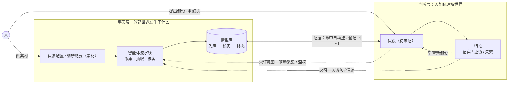

# 产品情报中心（Product Intelligence Hub）立项文档

- 版本：V2.0（由《Product Requirements.md》V1.1 精简重立为立项文档，功能口径移交 Backlog）
- 状态：已评审基线（实施进度由代码与测试反映，口径变更走版本号）
- 文档体系：本文档回答"为什么做与做什么"——需求细节见需求树 backlog/tasks（Backlog.md 工具），技术方案见 doc-002 架构（ADR 见 decisions）

---

## 1. 是什么

**由智能体驱动的行业/竞品情报系统**：智能体自动完成互联网情报的采集、核实、结构化入库；人提出假设、消费、判断、反馈；系统在使用中持续变聪明。兼容人工情报（参会见闻、访谈纪要）的统一录入。产出为可检索的情报库与结构化竞品档案，直接服务于产品规划与产品设计。

核心场景四条：

1. **日常监控**：系统自动盯信源，重要情报（新品发布、中标、专利）当日推送；
2. **情报录入**：参展回来丢入照片/录音/笔记，30 秒内完成、自动结构化入库；
3. **按需检索**："竞品 X 的无人化昼夜作业迭代历史？"——结构化筛选、详情溯源；
4. **假设求证**："露天煤矿的挖机师傅很难招募"——登记假设，系统持续匹配证据、命中即提醒，证据齐时人下结论。

## 2. 为什么做

产品规划依赖一手信息（实测、访谈）与二手信息（互联网公开信息、行业交流），当前四个痛点：

| 痛点 | 现状 |
|---|---|
| 盯不过来 | 情报分散数十个信源，人工盯覆盖不全、易遗漏 |
| 不敢用 | 可信度参差，无统一核实与标注，规划决策不敢直接引用 |
| 不沉淀 | 情报与假设散落聊天记录、个人笔记、会议纪要——假设无人持续求证，自然遗忘；人员流动即流失 |
| 重复劳动 | 竞品参数、功能对比靠临时整理，一遍遍重做 |

对应四条目标：智能体自动完成采集-核实-结构化；人工情报统一录入同链处理；产出可检索的情报库与竞品档案；以"领域包"配置化支持切换产品线/行业。

## 3. 重点是什么

系统的知识分两层，各有生命周期，互相咬合：

1. **事实层（生产支柱）**：人供素材——配置信源、录入调研纪要；智能体流水线自动完成采集、抽取、核实、聚类，产出情报。情报有自己的生命周期（入库→核实→终态），**终态必须人工**；
2. **判断层（进化支柱）**：人提出假设，假设有自己的生命周期（待求证→证实/证伪/失效，终态同样人工）与消费界面。核实后的假设成为**结论**——判断层的知识资产：可检索、可引用进规划文档、可作为新假设的证据（认知迭代），不回写情报表；
3. **两层咬合（数据闭环）**：证据向下——情报自动为活跃假设供给证据（新情报命中即挂、登记时回扫存量）；意图向上——假设的求证意图常驻管线，可升级为深挖/专题调研；结论反哺事实层采集方向。配合检索行为、字段级纠错、核实结论等反馈，驱动粗筛阈值与抽取提示词迭代——使用越多，抽取越准，与北极星指标（§7）同构。

由资源约束（1 人承担开发与运营）推出的工程纪律：自部署组件最少化（引入须论证）、无人值守流水线高度自动化、代码优先而非低代码平台、一切资产代码化/配置化可迁移。

## 4. 特色是什么

- **行业无关领域包**：核心域模型（主体—事件—来源—置信度—时效）不含行业知识；信源、关键词、竞品、标签树、模板、提示词封装为领域包配置，切换行业 = 改配置不改代码；
- **情报方法论迁移**：从威胁情报（CTI）数十年的验证方法论迁移——情报需求驱动的完整情报循环（PIR 假设求证 → 采集 → 分析 → 结论）、来源分级、Admiralty Code 置信度标注（来源可靠性 A–F × 信息可信度 1–6）、多源交叉印证、事实/推断强制分离；
- **两层知识，一体闭环**：事实层情报（外部发生了什么）与判断层假设/结论（人如何理解世界）分治建模、互相咬合——多数同类工具止步于"静态摘要"，本系统连认知一起沉淀、做复利；
- **1 人可运维**：单机部署、组件最少化、文档即运营手册，个人项目可持续。

## 5. 竞品格局

四类相邻产品，各自缺一角：

| 类别 | 代表 | 它们有 | 缺口 |
|---|---|---|---|
| 商业 CI SaaS | Crayon、Klue、Contify | 自动盯竞品、battlecard、AI 摘要（2026 趋势即 AI agent） | 面向销售/营销而非产品规划；不可自部署、数据出域；订阅成本与 1 人项目错配 |
| 国内商业监测 | 乐思、Meltwater 融文 | 媒体声量、舆情监测、报告 | 舆情/公关范式——无结构化情报 schema、无核实与置信度体系 |
| 开源 CTI 平台 | MISP、OpenCTI | 方法论同源（可靠性×可信度评级、connector 生态） | 域模型为安全指标非商业情报；平台重、面向团队，与 1 人运维冲突 |
| 开源 RSS/AI 阅读器 | Folo、RSSbrew、Miniflux | 自托管采集、AI 摘要、简报 | 阅读器范式——Feed 级非情报级：无 schema 抽取、无事件聚类、无置信度、反馈不回流 |

采集构件（changedetection.io、RSSHub、Newspaper4k）生态成熟但无整装产品；GitHub 同方向早期项目（Prism、Indra 等）均为个人实验阶段。

**结论**：「采集→结构化→核实→反馈迭代」完整流水线在开源界是空位，自建成立。

## 6. 不做什么

- 不做一手实测数据管理（试验数据、测试报告属 PLM/数据平台范畴）；
- 不做舆情情感分析、电商评论分析（属用户研究/营销范畴）；
- 不追求"全自动决策"——系统产出情报与判断依据，决策权在人；
- 不做权限体系——单用户内网部署阶段，静态凭据足够；
- Agent 同源消费、自然语言问答、竞品矩阵/档案页、专题调研等收进 Backlog 未来简表——方向不丢，不进核心闭环。

## 7. 成功判据

- **北极星指标**：情报库的周均检索使用次数（Web 访问 + API 调用合计）——系统设计以"被检索使用"为第一指标，对抗"采而不用沦为信息坟场"；
- **初期验收门槛**（随开发渐进校准）：
  - 真实检索 ≥ 20 次且三档记录；
  - 无人值守运行 4 周，中断 ≤ 1 次；
  - 入库情报 ≥ 60 条（参考值）；
  - 快照回溯抽样 20 条全部可溯。

## 8. 风险 Top 3

| 风险 | 缓解 |
|---|---|
| 采而不用，沦为信息坟场 | 北极星指标即"被使用"；周报强制人工精选；以开发者本人真实使用验收 |
| 1 人项目不可持续 | 全部资产代码化/配置化可迁移；文档即运营手册；组件最少化降低运维面 |
| 数据合规（robots/版权/招投标/专利/PII） | 遵守 robots；快照仅内部留存、对外仅链接+摘要 |
