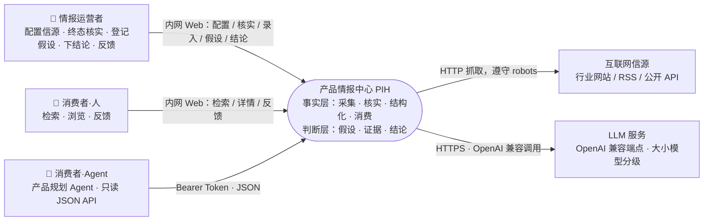
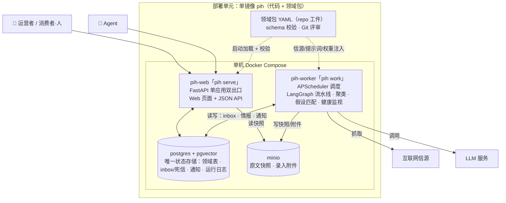
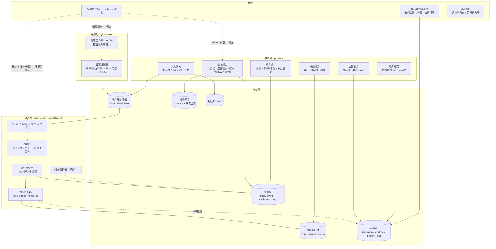
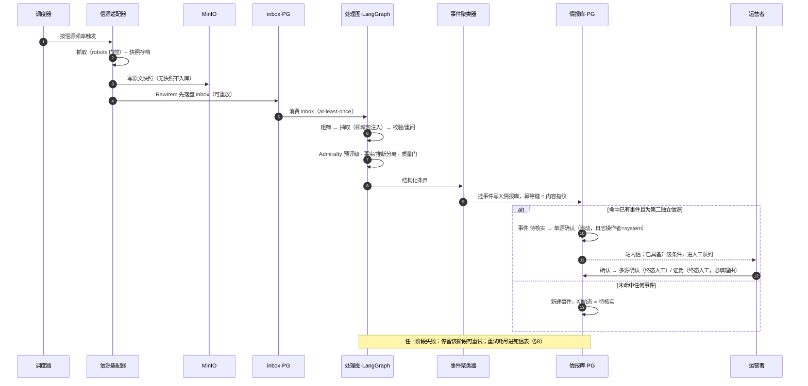
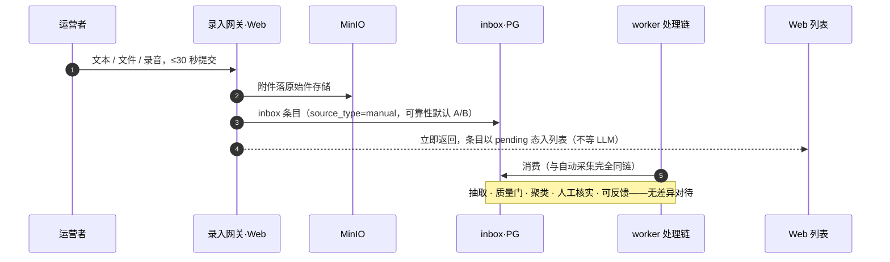
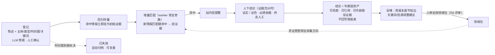
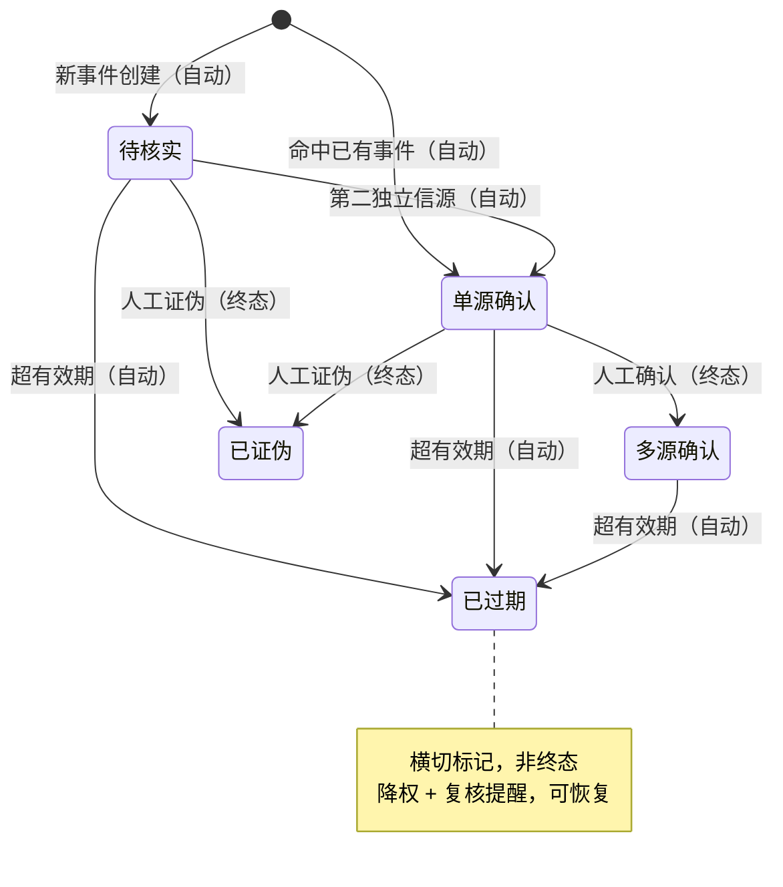
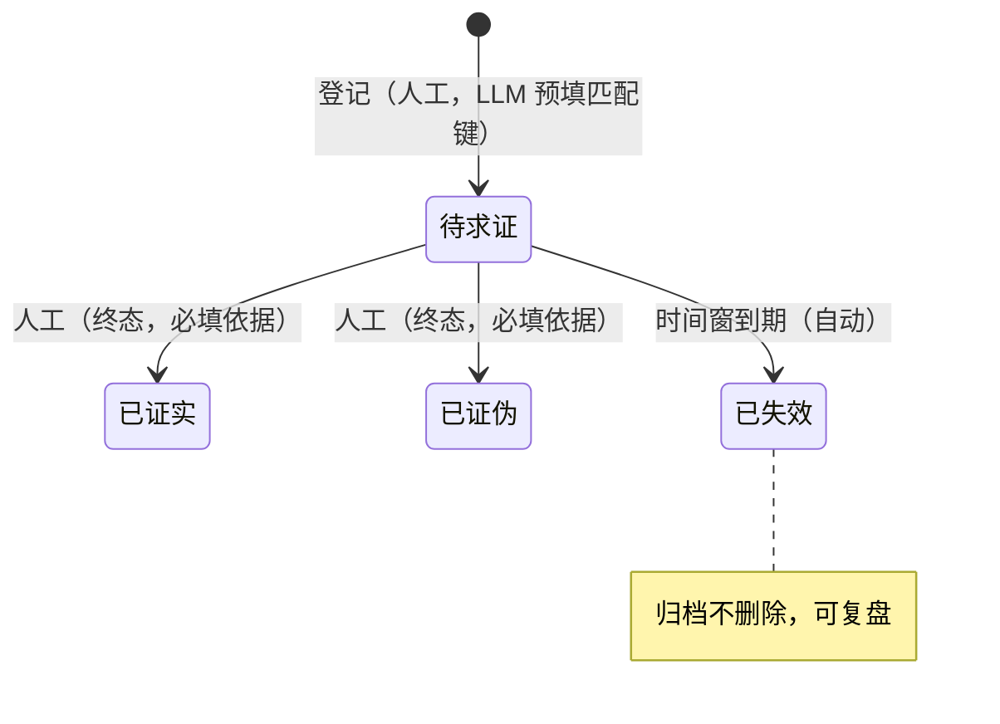
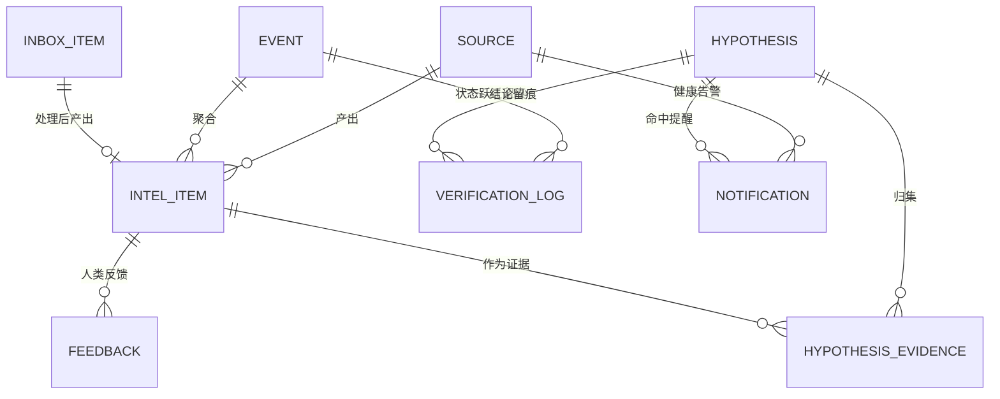
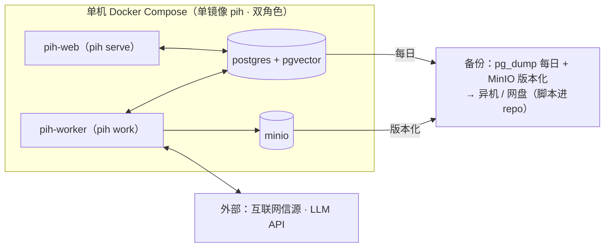

# 产品情报中心（Product Intelligence Hub）架构设计

- 版本：V2.0 · **Day0 重写**——以立项文档 doc-1 V2.0 与需求树（backlog/tasks，TASK-1..4）为唯一事实源，按 **C4 模型**重建；本文只写**目标态**，不陈述实现进度（进度由代码与测试反映）
- 配套：doc-1 立项 · doc-3 NFR · ADR backlog/decisions（§10 索引）· 可点击原型 docs/prototype.html（IA 验收参照，非架构事实源）
- 方法与图例：C4 分层——§2 系统上下文（L1）→ §3 容器（L2）→ §4 组件（L3），L4 代码级不做（单人系统维护成本大于收益）。图为 Mermaid 通用语法——不采用其原生 C4 语法（渲染质量差、写法繁琐），不引入 Structurizr 等外部工具链（违背资产最少化）；**实线** = 同步调用 / 读写，**虚线** = 配置注入 / 异步提醒，**圆柱** = 存储，👤 人 / 🤖 软件系统

## 1. 概览

**一句话**：一条「采集 → 核实 → 结构化 → 存储 → 消费」的情报流水线（事实层），加一条「假设 → 证据 → 结论 → 反哺」的判断层闭环；核心域模型行业无关，行业知识以领域包（Domain Pack，repo 内 YAML 配置）注入。

**四条贯穿性约束**（所有模块设计不得违反，NFR doc-3 依赖本节与 §8）：

1. **通用性在模型层，不在业务层**：核心代码不出现任何"挖机/工程机械"字样，行业知识全部来自领域包配置；
2. **一切 AI 产出可回溯**：每条入库情报必须能追溯到原文快照与来源，无快照不入库（§5.5）；
3. **人是核实的最终环节**：AI 只做预核实与分级；事件与假设的**终态**跃迁必须经人工，中间态可自动流转（§6.1 / §6.4）；
4. **1 人可运维**：系统须可被 1 人监控、修复、恢复——每个自部署组件都占用升级/备份/排障精力，引入须论证；优先可测试的代码资产，拒绝工作流黑盒。

**技术栈一览**：

| 关注点 | 选型 | 决策记录 |
|---|---|---|
| 语言/运行时 | Python 单代码库（uv 管理） | — |
| 流水线编排 | LangGraph（LLM 任务节点化） | ADR-004 |
| 采集调度 | APScheduler（worker 进程内） | ADR-004 / ADR-008 |
| Web / API | FastAPI 单应用双出口：服务端模板 Web + JSON API | ADR-006 |
| 主存储 | PostgreSQL + pgvector + 中文全文（zhparser/pg_jieba，备选应用层分词） | ADR-005 |
| 队列 / 死信 | PG 表承载（inbox / dead_letter），不引入 MQ | ADR-007 / ADR-009 |
| 对象存储 | MinIO（原文快照、录入附件） | §5.5 |
| 通知 | 站内信（PG 表 + Web 未读/已读/历史），外部渠道为演进方向 | §4 / §11 |
| 行业知识 | 领域包 YAML + schema 校验 | ADR-001 / §6.3 |
| 部署 | 单机 Docker Compose，单镜像双角色 | ADR-008 / §9 |

## 2. 系统上下文（C4 · L1）

| 参与者 / 外部系统 | 交互 | 信任边界与要点 |
|---|---|---|
| 👤 情报运营者 | 内网 Web 全部写操作 | 一人分饰多角；全部**终态人工**操作在此发生（ADR-002） |
| 👤 消费者·人 | 内网 Web 只读 + 反馈 | 与运营者通常同一人；内网默认开放（ADR-006） |
| 🤖 消费者·Agent（产品规划 Agent） | 只读 JSON API | **同一"消费者"角色、不同参与者类型**（软件系统）：通道/鉴权/交互形态均不同，故分开建模；静态 Bearer Token（ADR-006）；贡献者回写为演进方向（§11-A，复用录入网关接口） |
| 互联网信源 | 出站抓取 | robots 合规（NFR·合规）；单源故障不影响他源（§8） |
| LLM 服务 | 出站 API 调用 | 端点/模型可配置（`.env` 分层）；密钥不出本机 |

## 3. 容器视图（C4 · L2）

| 容器 | 职责 | 承载需求 |
|---|---|---|
| pih-web（`pih serve`） | 全部人与 Agent 的出口：列表/详情/筛选、核实页、假设页、录入、反馈、通知、信源页、配置 | TASK-2 全部、TASK-3.01/3.02 验收面、TASK-1.03、TASK-4.02 呈现 |
| pih-worker（`pih work`） | 无人值守生产全部写链路：调度采集、处理图、事件聚类、假设匹配、健康监视与告警、死信重放 | TASK-1.01/1.02、TASK-3.01 匹配、TASK-4.01/4.02 |
| postgres + pgvector | 单一事实源 + 混合检索（ADR-005）+ 轻量队列与通知载体 | ADR-005 / ADR-007 |
| minio | 原始件：原文快照 + 录入附件——"无快照不入库"的物理载体 | §5.5 |
| 领域包（工件，非进程） | 行业知识唯一载体，双端启动时加载注入 | ADR-001 / §6.3 |

**容器间契约**：worker 与 web **不直接通信**，唯一交互介质是 PG（含通知表）。两角色可独立重启互不拖累；无内部 API 就无版本协商问题，表结构（alembic 迁移）即契约。变更检测不设独立组件——轮询采集 + 内容指纹幂等天然吸收"内容未变"（重复抓取零新增行）。

## 4. 逻辑架构（C4 · L3 · 五层）

### 模块职责与关键接口

| 层 | 模块 | 职责 / 关键接口 | 承载 |
|---|---|---|---|
| 采集 | 调度器 | 按领域包信源频率触发；失败指数退避 ×3；连续 3 次失败告警 | TASK-4.01 |
| 采集 | 信源适配器 | `fetch(source) → RawItem[]`（RSS/网页/API）；robots 门控；试抓取（probe）产出成败报告，`enabled` 门控人在 YAML 终审 | TASK-1.01 |
| 处理 | 处理图（LangGraph） | 粗筛（小模型）→ 结构化抽取（大模型 + 领域包提示词）→ 校验（schema 失败自动重问）；Admiralty 预评级、事实/推断分离 | TASK-1.02 / ADR-004 |
| 处理 | 质量门 | 占位主体（未知/不详…）→ `needs_manual`；持续失败降级不丢弃 | TASK-1.02 / §6.5 |
| 处理 | 事件聚类器 | 主体归一（领域包别名）× 事件类型 × 时间窗 → 挂事件；双独立信源自动跃迁 | ADR-003 / TASK-2.02 |
| 处理 | 假设匹配器 | 活跃假设：登记时回扫存量 + 新情报增量匹配（匹配键同聚类）；命中挂证据 + 站内信；旁路失败不影响主链 | TASK-3.01 / ADR-010 |
| 处理 | 时效管理器 | 有效期、decay、过期降权与失效（规划，draft-009） | §6.2 |
| 存储 | 情报库 / 假设证据 / 收件箱死信 / 运营表 / 检索索引 / 快照库 | 见 §7、§5.5 | ADR-005 / ADR-007 |
| 消费 | 查询服务 | 结构化过滤 + score 排序（§6.2），Web 与 JSON API 同源同序 | TASK-2.01 / ADR-006 |
| 消费 | 核实操作 | 核实队列（置信度升序 + 最老优先）：升级确认 / 证伪 / 积压提醒 | TASK-2.02 |
| 消费 | 假设服务 | 登记（LLM 预填匹配键，人工确认）、证据链视图、结论操作与复盘 | TASK-3.01/3.02 |
| 消费 | 录入网关 | `ingest(manual) → inbox + MinIO`；单次录入 ≤30 秒，条目即时入列表 | TASK-1.03 / ADR-009 |
| 消费 | 反馈服务 | 四动作反馈（主体错/类型错/事实不准/不该入库）+ 聚合视图 + JSONL 导出 | TASK-4.03 |
| 消费 | 通知服务 | 站内信未读/已读/历史 | TASK-4.02 / TASK-3.01 |
| 横切 | 领域包 | YAML + schema 校验 + Git 版本化（§6.3） | ADR-001 |
| 横切 | 健康监视与巡检 | 信源连续失败检测 → 告警；每日巡检报表（§8） | TASK-4.02 |
| 横切 | 可观测性 | 结构化日志 + pipeline_run 运行留痕 | §8 |

> 消费层组件全部是 pih-web 内的模块（FastAPI 路由层之下、仓储层之上的服务层）；采集/处理层组件全部是 pih-worker 内的模块。src-layout 包结构与本层划分一一对应（`collect` / `process` / `store` / `consume` / `domainpacks`）。

## 5. 核心数据流

### 5.1 互联网情报主链路

主链一条：调度 → 抓取落盘 → 处理图 → 聚类入库 → 人工终态核实，全程留痕（ADR-007 / ADR-002）。

### 5.2 人工录入链路（与主链在 inbox 汇聚）

人工情报的唯一特殊点是**入口与默认可靠性**（A/B 级：本人一手见闻可信，但仍需事实核查与核实闭环），处理链零特判（ADR-009）。

### 5.3 假设求证循环（判断层）

### 5.4 检索消费

**结构化检索**：筛选条件（主体 / 事件类型 / 时间 / 标签 / 置信度 / 处理状态 / 事件核实状态）→ SQL 结构化过滤 → score 排序（§6.2）→ 列表 / 详情。出口两类：Web 页面与 JSON API，同源同序（ADR-006）。

**语义/混合检索**：同批数据经 pgvector + 中文全文两路召回提供语义查询端点（API）——检索质量属产品本身。**自然语言问答（RAG）不属产品范围**：检索半由本产品 API 承载，生成半由消费方 Agent 组合实现（§11-B）。

### 5.5 快照与可回溯

采集即存档：原文快照（HTML/PDF/截图）与录入附件写入 MinIO，`intel_item.snapshot_id` 关联；**无快照不入库**（贯穿性约束 2 的落实）。检索引用同时给出快照与原始链接双入口。合规上快照仅内部留存，对外分享仅给链接与摘要。只存 URL 的方案被否决：链接腐烂后"可回溯"约束崩塌。

## 6. 核心设计

### 6.1 事件核实状态机（事实层 · 状态挂事件层）

**层级**：核实状态挂在**事件层**（`event` 表）；情报条目不持有独立状态，详情页展示"所属事件的状态 + 本条目的核实日志"（ADR-003）。

| 跃迁 | 触发者 | 触发条件 | 说明 |
|---|---|---|---|
| （初始）→ 待核实 | 自动 | 新事件创建 | 新聚类事件的默认初始态 |
| （初始）→ 单源确认 | 自动 | 新情报命中已有事件 | 见下"初始态规则" |
| 待核实 → 单源确认 | 自动 | 该事件获得第二个独立信源 | 中间态自动流转 |
| 单源确认 → 多源确认 | **人工** | 双独立信源 + 运营者确认 | 事件"已具备升级条件"后进人工队列 |
| 待核实/单源确认 → 已证伪 | **人工** | 运营者证伪（必填理由） | 终态；该事件下情报检索默认隐藏 |
| 任何状态 → 已过期 | 自动 | 超过有效期 | 降权 + 复核提醒，可恢复 |

**初始态规则**：新情报独立成新事件 → `待核实`；命中已有事件 → 挂入该事件，若为第二个独立信源则自动 `待核实 → 单源确认`。

**留痕规则**：所有跃迁（含自动）统一走状态机入口并写 `verification_log`（自动跃迁操作者 = `system`），禁止绕过；详情页时间线 = 事件状态跃迁 + 条目挂入历史。

### 6.2 置信度与排序

**置信度词表——Admiralty Code**：来源可靠性 A–F × 信息可信度 1–6，单字符双维度（如 B2）；LLM 预评级与人工评级共用同一词表；评级证据驱动（信源画像为演进方向，基于 verification_log 历史结局重估）。不采用百分制/星级：连续值难对齐、难口头沟通、LLM 输出不稳定。

**排序函数**：`score = W_c × map(admiralty) × decay(now - 采集时间)`

- `map(admiralty)`：可靠性 A–F 与可信度 1–6 分别映射到 1.0–0，**两者取小**（短板决定）；
- `decay`：分段——有效期前 1/3 不衰减，中段线性衰减至 0.5，过期后 0.3 并叠加"已过期"标记；
- `W_c`：事件状态权重——多源确认 1.0 / 单源确认 0.8 / 待核实 0.5 / 已证伪 0（默认不出现在结果）；
- 初始权重如上，作为领域包可调参数（`ranking:` 节），运行期观察调优。

**学习排序（LTR）为显式非目标**：单用户、<10 万条场景下既无训练数据量也无验证手段；重估触发条件 = 检索反馈日志积累到可构建离线评估集。"越用越聪明"不由排序函数承担，而由三条**证据驱动闭环**承载：反馈错误样本 → 抽取提示词迭代；核实历史结局 → 信源可靠性重估（评级证据驱动）；检索日志 → ranking 权重调优——全部经人审/统计证据更新配置或资产，可审计可回滚。

### 6.3 领域包机制

领域包 = { 信源清单, 监控关键词, 竞品主体清单, 标签树, 报告模板, 抽取提示词, ranking 权重 }，以 repo 内 YAML 维护，带 schema 校验（缺必选字段拒绝加载并指出位置），Git 版本化评审（§3）。新增领域 = 新增 `domain_packs/<domain>/pack.yaml`，核心代码零变更。为何是配置而非插件、为何推迟插件化：见 ADR-001。假设反哺的关键词/信源调整建议亦由人落到领域包（§5.3，ADR-010）。

### 6.4 假设状态机（判断层 · 新）

- **证据规则**：假设与情报多对多（`hypothesis_evidence`）；匹配键与事件聚类共用（主体归一 × 事件类型 × 时间窗）；登记即回扫存量，之后增量匹配；
- **结论资产化**：终态假设即**结论**——判断层知识资产，含依据、证据链与结论时间；可检索、可引用进规划文档、可挂为新假设的证据（认知迭代）；**不回写情报表**（事实/判断两层分治，doc-1 §3）；
- **反哺规则**：结论关键词进入周报复盘节，产出监控关键词与信源调整**建议**；系统不自动改领域包——与"终态人工"同一纪律（ADR-010）；
- **自动辅助（终态人工不变）**：① **证据充分度标记**——独立信源数 ≥2 / 证据条数 / 置信度构成 / 时间窗余量综合计算，达标假设标"已具备结论条件"并进就绪队列置顶（与事件侧"已具备升级条件"同构，ADR-002）；② **LLM 倾向性草稿**——假设详情页自动生成证据倾向摘要（支持 / 反驳 / 证据不足 + 引用），人参考后拍板。分析可以自动，**判断权不交**。

### 6.5 人机同链与质量门（新）

- **inbox 汇聚语义**：处理链的唯一输入是 inbox 条目（raw 文本 + 附件引用 + 来源标记）；信源适配器与录入网关都只是 inbox 的生产者——两链在此汇成一链（ADR-009）；
- **人工来源规则**：`source_type=manual`，Admiralty 来源可靠性默认 A/B（一手见闻），信息可信度照常由抽取与核实评定——"仍需事实核查"；
- **录入即时可见**：录入网关落盘即返回，条目以 `pending` 态进 Web 列表，结构化异步完成——30 秒约束指人的操作时间；
- **质量门**：主体抽成占位值 → `needs_manual`（字段保留供复核）；schema 校验失败自动重问，持续失败降级 `needs_manual`，**降级不丢弃**；粗筛判无关行级标记 `filtered_out` 保留可审计。

## 7. 数据架构

> 注：死信（dead_letter）为 inbox 条目的失败终态标记而非独立实体；pipeline_run 记录每次调度运行（吞吐/失败/时长/token）。

**PostgreSQL 单一事实源**（ADR-005/007），表按层分组：

| 层 | 表 | 要点 |
|---|---|---|
| 事实层 | `source` | 信源注册与健康统计；`enabled` 门控人在领域包 YAML 终审 |
| 事实层 | `inbox_item` | 原始内容先落盘（可回放）；来源标记（采集/人工）；阶段状态 |
| 事实层 | `intel_item` | 结构化字段（JSONB + GIN，主体/标签 containment 筛选）；`content_sha1` UNIQUE 幂等；`snapshot_id` → MinIO；Admiralty 码；`process_status` 处理状态机 |
| 事实层 | `event` / `verification_log` | 核实状态机（§6.1）：状态挂事件层，跃迁全程留痕 |
| 判断层 | `hypothesis` | 陈述 + 匹配键（主体/类型/时间窗/关键词）+ 状态机（§6.4）+ 结论字段（依据/时间） |
| 判断层 | `hypothesis_evidence` | 假设 × 情报多对多 + 命中时间 |
| 运营层 | `notification` | 站内信（信源健康 / 假设命中 / 流水线异常），未读/已读 |
| 运营层 | `feedback` | 四动作反馈 + 事实项级标注，错误样本驱动提示词迭代 |
| 运营层 | `pipeline_run` | 每次运行的吞吐/失败/时长/token 用量（§8 可观测底座） |
| 检索 | pgvector 向量 + 中文全文 tsvector | 混合检索单库闭环；中文分词扩展失败时备选应用层预分词（ADR-005） |

**MinIO**：原文快照 + 录入附件，`intel_item.snapshot_id` 关联（§5.5）。

**规划中**（§11 演进，表结构暂不建）：`entity` / `competitor_profile` / `feature_matrix` / `param_matrix`（竞品资产库）；`domain_pack` 加载快照表。

## 8. 可靠性与可观测

**语义**：at-least-once + 幂等处理（ADR-007）。核心原则——**原始内容先落盘，处理永远可以重放**。

| 环节 | 失败处理 |
|---|---|
| 调度 | worker 崩溃由 compose 自动拉起；任务幂等可重入，错过的周期下一轮补跑（不做追赶风暴） |
| 抓取 | 适配器重试（指数退避 ×3）→ 计入信源健康；连续 3 次失败站内信告警，单源故障不阻断他源 |
| 落盘后处理 | inbox 持久化；任一阶段失败停留该阶段可重试，不回滚已成功阶段；重试耗尽进死信，CLI / 核实页可查、可重放、可丢弃（丢弃留痕） |
| LLM 调用 | 重试 ×3 + schema 校验失败自动重问；持续失败降级 `needs_manual`，不丢弃 |
| 入库 | 幂等键 = 快照内容指纹；重复抓取 / 重复投递不产生重复行 |
| 状态跃迁 | 全部走状态机统一入口，自动跃迁写日志（操作者=`system`），禁止绕过 |
| 假设匹配 | 旁路阶段：匹配失败不影响主链入库，独立重试 |

**可观测性**：结构化日志（JSON lines）+ `pipeline_run` 运行留痕；每日巡检报表（采集成功率、粗筛通过率、核实与假设积压、token 用量）为 1 人运营的巡检入口；异常（信源失败、流水线错误）一律走站内信——**告警与消费同一入口**，不引入外部监控组件。

## 9. 部署架构

### 9.1 拓扑与备份

单镜像双角色（ADR-008）：compose 以不同 command 起两容器，构建/升级/回滚一次完成；CLI 运维命令（probe / collect / verify / query…）`docker compose run pih <cmd>` 按需执行。数据库每日备份 + 快照版本化，备份脚本进 repo、恢复步骤文档化——**1 人可恢复是硬要求**（贯穿性约束 4）。

### 9.2 LLM 分级调用与成本模型

| 任务 | 模型档位 |
|---|---|
| 粗筛 / 去重 | 小模型（非推理档——推理档粗筛"省时间"预期不成立，ADR-004 实测） |
| 结构化抽取 / 校验重问 | 大模型 |
| 报告生成（演进） | 大模型 |

全部端点可配置（OpenAI 兼容，支持自有模型服务），模型路由集中管理，换模型/换端点不改代码。否决两个极端：全旗舰（粗筛无需强模型，成本数倍）与全小模型（抽取准确率不达标）。

**成本公式**：月成本 ≈ Σ_任务(信源数 × 日抓取量 × 粗筛通过率 × 平均 token × 单价)。以 10 信源、日均 80 条、通过率 30% 估算，月成本约 200–400 元（自有服务折算算力）。
**实测校准**（25 样本端到端，详见 ADR-004 注）：成功率 92%，中位 19.7s/条，抽取 ~4.7k tokens/条；上线后以实际用量校准。

## 10. ADR 索引

| 编号 | 标题 | 一句话决策 |
|---|---|---|
| ADR-001 | 领域包为配置而非插件机制 | 行业知识 = repo 内 YAML + schema 校验；插件化推迟到第二领域真实接入 |
| ADR-002 | 核实采用两段式 | 中间态自动流转，两个终态必须人工，全程留痕 |
| ADR-003 | 事件与情报分离建模 | 状态挂事件层，交叉印证语义自洽 |
| ADR-004 | 流水线编排代码化 | LangGraph + APScheduler，不引入低代码平台 |
| ADR-005 | 单一 PostgreSQL 承载混合检索 | pgvector + PG 中文全文，单库闭环 |
| ADR-006 | 消费端 Web 与 API 同源 | 单一 FastAPI 应用双出口，人与 Agent 同一事实源 |
| ADR-007 | 流水线可靠性语义 | at-least-once + 幂等，先落盘可重放 |
| ADR-008 | 单一部署单元双运行角色 | 单镜像 `pih serve` / `pih work`，交互介质仅 PG |
| ADR-009 | 人机情报在收件箱汇聚 | 录入网关只生产 inbox，处理链零特判 |
| ADR-010 | 判断层常驻流水线、结论与反哺经人工 | 假设匹配为 worker 旁路阶段；结论终态人工；反哺只出建议 |

（ADR-NNN 与文件 `decision-NN` 同号对应，正文见 `backlog/decisions/`。）

## 11. 演进方向与产品边界

**B · 产品外·消费侧组合**：以下能力由消费方 Agent 基于本产品 API（未来可加薄 MCP 端点）组合实现，**不进产品范围**——检索半在产品 API，生成半在消费方：

| 能力 | 产品侧需提供 | 线索 |
|---|---|---|
| 自然语言问答（RAG） | 结构化过滤 + 语义/混合检索端点 + 来源/快照/置信度字段（均已在本范围） | draft-002 |
| 报告成文与摘要生成 | 周报复盘**数据视图**（结论 + 建议清单，产品内）；成文生成在消费侧 | draft-005（生成部分） |

**A · 产品内演进**（当前范围外，方向不丢）：

| 方向 | 内容 | 预留 |
|---|---|---|
| 竞品资产库 | 竞品档案页、功能/参数矩阵 | §7 规划表；draft-003 / draft-004 |
| 重大事件即时推送 | 外部渠道（企微/邮件）推送 | 通知表类型化设计，加渠道不改模型；draft-006 |
| 专题调研 | 假设求证意图升级为深挖/专题 | §5.3 求证意图常驻管线；draft-007 |
| 信源画像 | 基于 verification_log 历史结局重估信源可靠性 | 评级证据驱动原则（§6.2）；draft-008 |
| 时效治理 | decay / 过期降权 / 复核提醒全量落地 | §6.2 排序函数已含 decay 项；draft-009 |
| Agent 贡献者回写 | Agent 提交线索走录入网关 | ADR-009 网关接口复用；draft-001 |
| 领域包插件化 | 领域逻辑随包分发 | ADR-001：第二领域真实接入后评估 |
