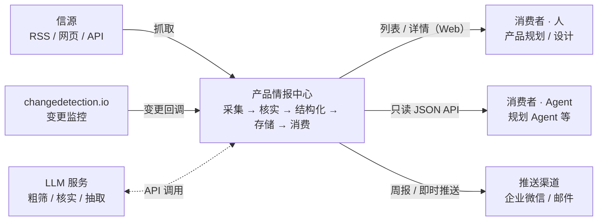
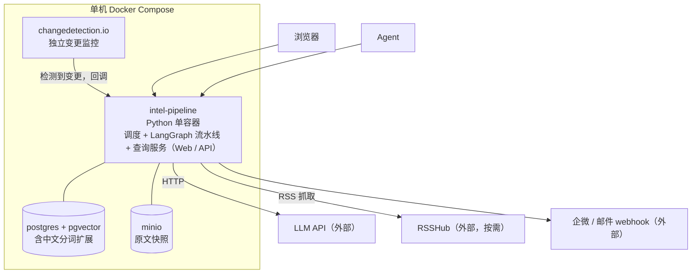
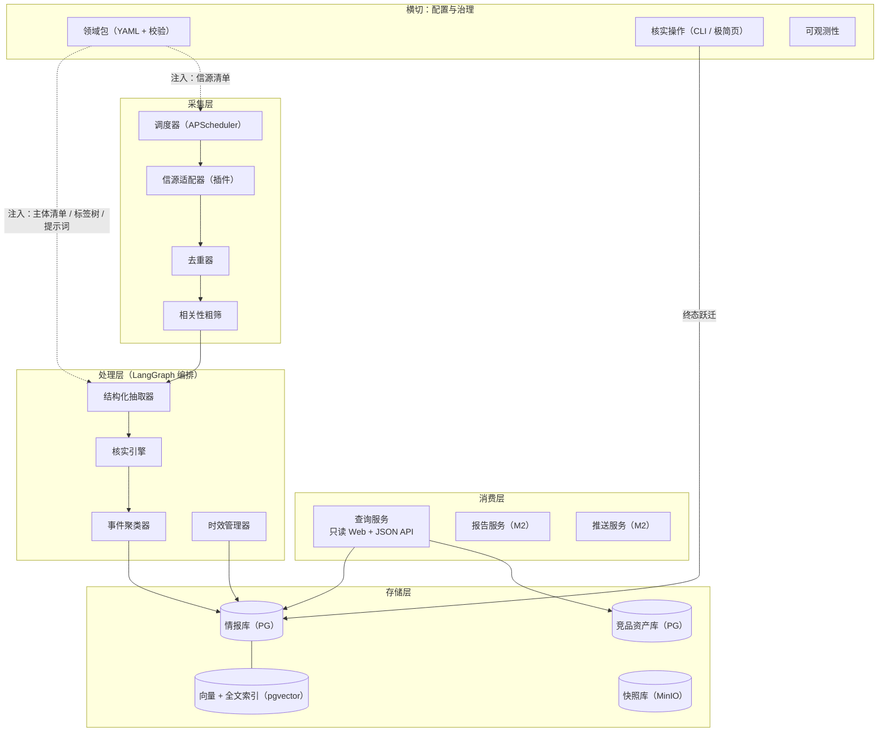
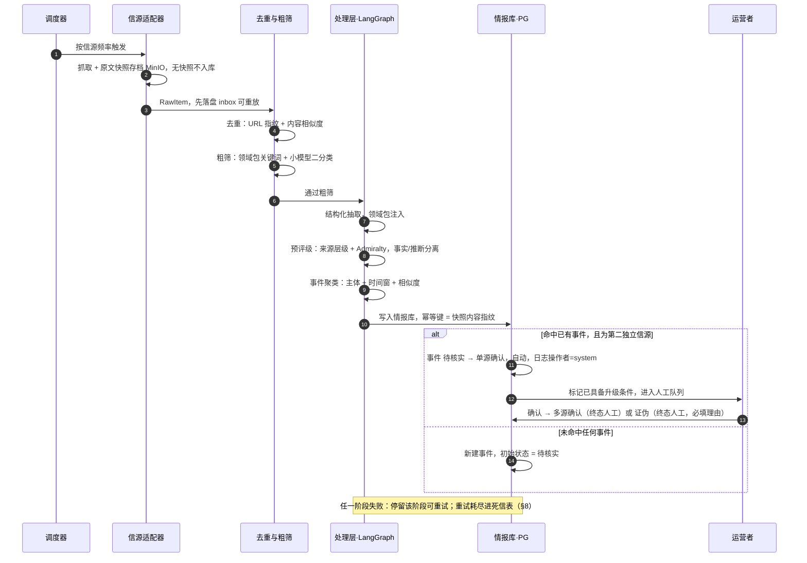
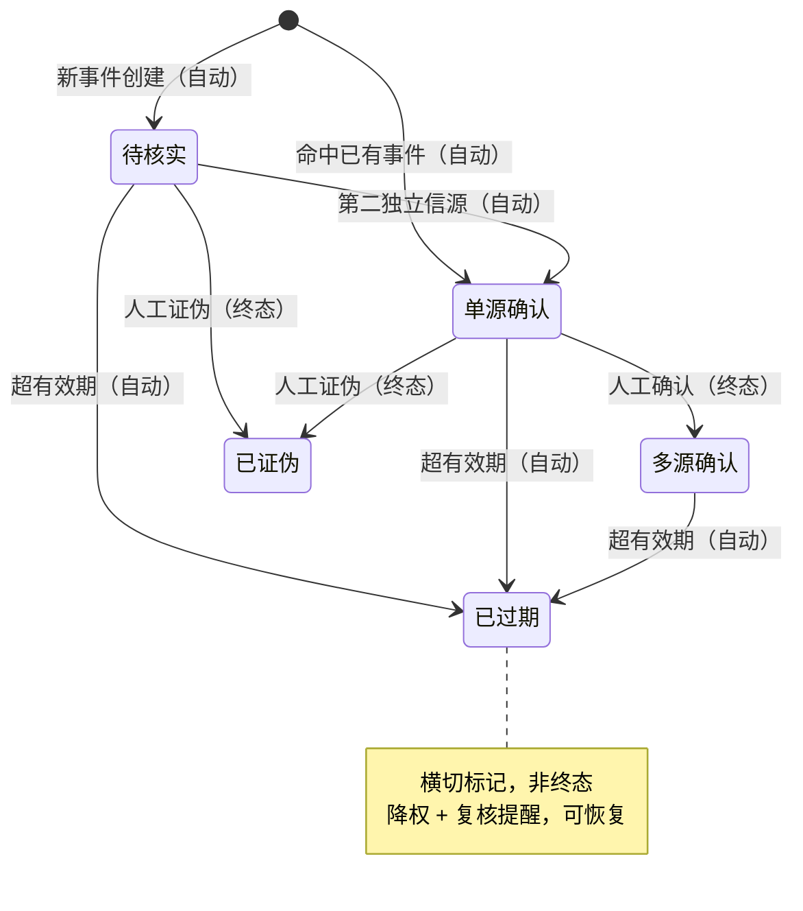
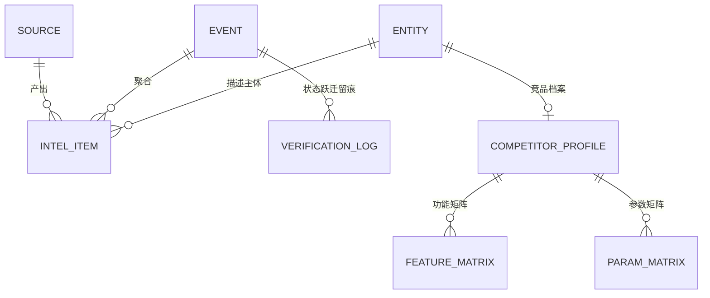
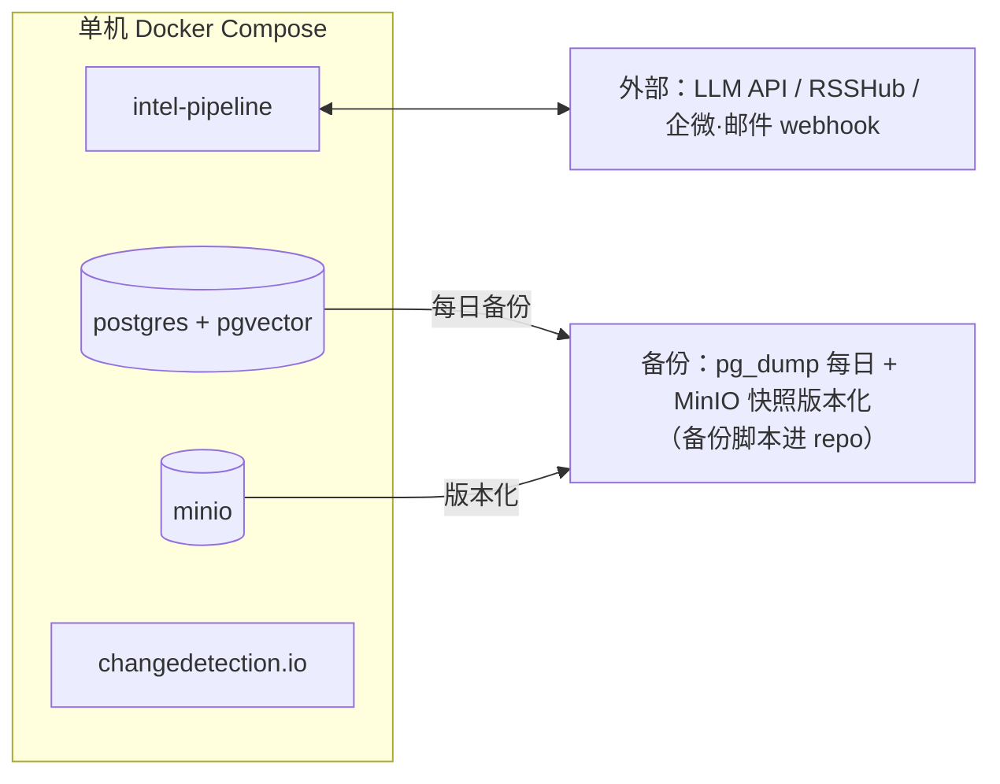

# 产品情报中心（Product Intelligence Hub）架构设计

- 版本：V0.9（Sprint 0 回写同步；ADR 拆分至 docs/adr/）
- 日期：2026-08-25
- 配套：《Product Requirements.md》V1.0、《Backlog.md》V0.9
- 变更：V0.8→V0.9 Sprint 0 回写——§9.2 补 SPK-2/SPK-3 实测 token 与延迟值（大模型 2997+1729 tokens/20s，小模型与大模型同量级）；ADR-004 后果节补 SPK-3 实测结论（成功率 92%，ADR-004 维持）
- 用途：指导 Backlog 梳理与模块设计；关键决策记录见 §10 索引

## 1. 概览

**一句话**：一条"采集 → 核实 → 结构化 → 存储 → 消费"的情报流水线，核心域模型行业无关，行业知识以领域包（Domain Pack，repo 内 YAML 配置）注入。

**四条贯穿性约束**（所有模块设计不得违反）：

1. **通用性在模型层，不在业务层**：核心代码不出现任何"挖机/工程机械"字样，行业知识全部来自领域包配置；
2. **一切 AI 产出可回溯**：每条入库情报必须能追溯到原文快照与来源，无快照不入库（§5.3）；
3. **人是核实的最终环节**：AI 只做预核实与分级；`多源确认` 与 `已证伪` 两个**终态**的跃迁必须经人工，中间态可自动流转（§6.1）；
4. **1 人可运维**：系统须可被 1 人监控、修复、恢复——每个自部署组件都占用升级/备份/排障精力，引入须论证；优先可测试的代码资产，拒绝工作流黑盒。

**技术栈一览**：

| 关注点 | 选型 | 决策记录 |
|---|---|---|
| 语言/运行时 | Python 单应用 | — |
| 流水线编排 | LangGraph（LLM 任务节点化） | ADR-004 |
| 采集调度 | APScheduler（进程内） | ADR-004 |
| 查询服务 | FastAPI：服务端模板 Web + JSON API 同源 | ADR-006 |
| 主存储 | PostgreSQL + pgvector + 中文全文（zhparser/pg_jieba） | ADR-005 |
| 对象存储 | MinIO（原文快照） | §5.3 |
| 变更监控 | changedetection.io（独立容器，回调流水线） | §3 |
| 行业知识 | 领域包 YAML + schema 校验 | ADR-001 |
| 部署 | 单机 Docker Compose | §9 |

## 2. 系统上下文

外部依赖三类：信源、LLM API、推送渠道。消费方为消费者角色，承担者为人（Web）或 Agent（只读 API，ADR-006）。文件与人工录入、Agent 贡献者回写为后续方向，M1 仅预留接口（§4）。无其他系统耦合，可独立部署演进。

## 3. 容器视图

| 容器 | 职责 | 说明 |
|---|---|---|
| intel-pipeline | 调度、LangGraph 处理流水线、查询服务（Web + API） | 单容器单进程族，代码资产可测试（ADR-004） |
| postgres + pgvector | 单一事实源 + 向量/全文索引 | ADR-005 |
| minio | 原文快照与附件 | §5.3 |
| changedetection.io | 网页变更监控，检测到变更回调流水线 | 官方镜像自部署，不二次开发 |

> **Sprint 1 实测**（2026-08-25，工程脚手架）：`pgvector/pgvector:pg16` 镜像 `CREATE EXTENSION vector` 验证通过；中文分词扩展（zhparser/pg_jieba）不含于该镜像，推迟到 M1 全文检索 Sprint 单独验证镜像选型（本 Sprint 仅验 pgvector 本体可用，与 §7"M1 规模"无矛盾）。MinIO bucket 可建、app 容器可 `import pih` 并端到端加载领域包。

## 4. 逻辑架构

### 模块职责与关键接口

里程碑标注为设计预期；Backlog 不再承载分期，Sprint 规划时按此校准。

| 模块 | 职责 | 关键接口/产出 | 里程碑 |
|---|---|---|---|
| 信源适配器 | 按类型抓取（RSS/网页/API/变更监控），插件化 | `fetch(source) → RawItem[]` | M1 |
| 调度器 | 按信源频率触发，失败重试与告警 | APScheduler + 进程内任务队列 | M1 |
| 去重器 | URL 指纹 + 内容相似度 | `dedup(RawItem) → bool` | M1 |
| 相关性粗筛 | 关键词 + 小模型二分类 | `classify(RawItem) → keep/drop` | M1 |
| 快照采集 | 原文存档（HTML/PDF/截图） | 存 MinIO，返回快照 ID | M1 |
| 核实引擎 | 来源分级、Admiralty 评级、事实/推断分离 | `verify(item) → IntelItem(预核实)` | M1 |
| 事件聚类器 | 同事件多源聚类，驱动交叉印证 | `cluster(item) → event_id` | M1（简版）/后续方向 |
| 结构化抽取器 | 按 schema 抽取主体/事件/参数/标签 | `extract(item, pack) → IntelItem` | M1 |
| 时效管理器 | 有效期计算、过期降权、复核提醒 | 定时任务 | M1 |
| 情报库 | 情报主表 + 核实流转日志 | CRUD + 状态机 | M1 |
| 竞品资产库 | 竞品档案、功能/参数矩阵 | 表结构 M1，自动维护为后续方向 | M1 |
| 查询服务（Web + API） | 筛选列表 + 情报详情（含事件状态与核实历史），页面与 JSON API 同源 | FastAPI：服务端模板 + REST（ADR-006） | M1 |
| RAG 问答服务 | 混合检索问答，答案强制带引用 | `ask(query) → answer + citations[]` | M2（混合检索，ADR-005） |
| 报告服务 | 周/月报生成 | 模板由领域包提供 | M2 |
| 推送服务 | 即时/定期推送 | 渠道可配置 | M2 |
| 领域包 | YAML + schema 校验 + Git 版本化 | 加载器、校验器 | M1 |
| 核实操作 | 人工确认/证伪（终态跃迁），写日志 | CLI（M1），Web 化为后续方向 | M1 |
| 人工录入网关 | 文本/文件/语音统一入口（与自动采集同一流水线，仅入口不同；Agent 贡献者回写复用此入口，见 ADR-006） | `ingest(manual) → RawItem` | 后续方向（M1 仅定义接口） |

## 5. 核心数据流

### 5.1 互联网情报主流程（核心链路）

主链一条：调度器按信源频率触发采集，原始内容先落盘 inbox、原文快照存档 MinIO，经去重与粗筛后进入 LangGraph 处理链（结构化抽取 → 预评级 → 事件聚类）写入情报库，终态核实（确认/证伪）由人工操作完成并写 verification_log。

> SPK-3 验证范围说明（2026-08-25）：Sprint 0 端到端验证覆盖主链的**粗筛 → 结构化抽取 → schema 校验**三段子集；去重、预评级、事件聚类、终态人工核实四段留待 M1 实施期。三段子集端到端成功率 92%（23/25），ADR-004 维持。

（后续迭代）重大事件即时推送 + 汇入周报

### 5.2 检索流程

M1：筛选条件（主体/事件类型/时间/标签/置信度）→ SQL 结构化过滤 → 按 score 排序（§6.2）→ 列表/详情。出口两类：Web 页面与 JSON API，同源（ADR-006）。

M2：自然语言提问 → 意图解析（问答/筛选/对比）→ 混合召回（BM25 ∪ 向量，ADR-005）+ 结构化过滤 → 按 score 重排 → LLM 生成答案（强制引用：情报 ID + 来源 + 置信度）。

### 5.3 快照与可回溯

采集即存档：原文快照（HTML/PDF/截图）写入 MinIO，`intel_item.snapshot_id` 关联；**无快照不入库**（贯穿性约束 2 的落实）。检索引用同时给出快照与原始链接双入口；存储成本以文本为主，可忽略；合规上对外分享仅给链接与摘要。

只存 URL 的方案被否决：链接腐烂后情报不可回溯，"可回溯"约束崩塌。

## 6. 核心设计

### 6.1 核实状态机（唯一事实源）

**层级**：核实状态挂在**事件层**（`event` 表）；情报条目（`intel_item`）不持有独立状态，详情页展示"所属事件的状态 + 本条目的核实日志"（ADR-003）。

| 跃迁 | 触发者 | 触发条件 | 说明 |
|---|---|---|---|
| （初始）→ 待核实 | 自动 | 新事件创建 | 新聚类事件的默认初始态 |
| （初始）→ 单源确认 | 自动 | 新情报命中已有事件 | 见下"初始态规则" |
| 待核实 → 单源确认 | 自动 | 该事件获得第二个独立信源 | 中间态自动流转 |
| 单源确认 → 多源确认 | **人工** | 双独立信源 + 运营者确认 | 事件标记"已具备升级条件"后进人工队列 |
| 待核实/单源确认 → 已证伪 | **人工** | 运营者证伪（必填理由） | 终态 |
| 任何状态 → 已过期 | 自动 | 超过有效期 | 降权 + 复核提醒，可恢复 |

**初始态规则**：新情报独立成新事件 → 事件初始 `待核实`；新情报聚类命中已有事件 → 条目挂入该事件，若此为第二个独立信源，事件自动 `待核实 → 单源确认`。

**两层状态同步规则**：事件状态即聚合展示状态；条目级 `verification_log` 记录每一次跃迁（自动跃迁也记，操作者标 `system`），详情页时间线 = 事件状态跃迁 + 条目挂入历史。

### 6.2 置信度与排序

**置信度词表——Admiralty Code**（借用威胁情报成熟标准）：来源可靠性 A–F × 信息可信度 1–6，单字符双维度（如 B2）；LLM 预评级与人工评级共用同一词表；评级证据驱动（信源画像为后续方向，基于 verification_log 历史结局重估）。不采用百分制/星级：连续值难对齐、难口头沟通、LLM 输出不稳定。

**排序函数**：

`score = W_c × map(admiralty) × decay(now - 采集时间)`

- `map(admiralty)`：来源可靠性 A–F → {A:1.0, B:0.8, C:0.6, D:0.4, E:0.2, F:0}；信息可信度 1–6 → {1:1.0, 2:0.8, 3:0.6, 4:0.4, 5:0.2, 6:0}；两者取小（短板决定）后线性组合；
- `decay`：分段函数——有效期前 1/3 不衰减，中段线性衰减至 0.5，过期后 0.3 并叠加"已过期"标记；
- `W_c`：事件状态权重——多源确认 1.0 / 单源确认 0.8 / 待核实 0.5 / 已证伪 0（默认不出现在结果中）；
- 初始权重如上，作为领域包可调参数（`ranking:` 节），M1 运行期观察调优。

### 6.3 领域包机制

领域包 = { 信源清单, 监控关键词, 竞品主体清单, 标签树, 报告模板, 抽取提示词 }，以 repo 内 YAML 维护，带 schema 校验（缺必选字段拒绝加载并指出位置），Git 版本化评审；配置含 `ranking:` 节可调排序权重（§6.2）。为何是配置而非插件、为何推迟插件化：见 ADR-001。加载器与校验器是最优先技术任务。

## 7. 数据架构

- **PostgreSQL** 为单一事实源：`intel_item`、`entity`、`source`、`event`、`verification_log`、`domain_pack`、`competitor_profile`、`feature_matrix`、`param_matrix`；
- **pgvector** 承载情报摘要向量 + **PG 中文全文检索**（zhparser 或 pg_jieba）承担 BM25 侧——混合检索在单库内闭环（M1 规模 < 10 万条，无需独立向量库）；
- **MinIO** 存原文快照与附件，`intel_item.snapshot_id` 关联；
- 事件（`event`）与情报（`intel_item`）一对多：交叉印证的载体，核实状态挂事件层、来源各挂各的；
- `verification_log` 同时是未来信源画像的数据底座（需求文档 §4.1）；
- `inbox` 与 `dead_letter` 为流水线可靠性表（§8）；
- `domain_pack` 表仅存加载快照与校验结果，事实源是 repo 内 YAML（§6.3）。

## 8. 可靠性与可观测

**语义**：at-least-once + 幂等处理（ADR-007）。核心原则——**原始内容先落盘，处理永远可以重放**。

| 环节 | 失败处理 |
|---|---|
| 抓取 | 适配器重试（指数退避 ×3）→ 失败计入信源健康，连续 3 次告警 |
| 落盘后处理 | inbox 原始内容持久化；任一阶段失败，条目停留该阶段可重试，不回滚已成功阶段 |
| LLM 调用 | 重试 ×3 + 结构化输出校验失败自动重问；持续失败降级为"待人工"，不丢弃 |
| 入库 | 幂等键 = 快照内容指纹；重复处理不产生重复条目 |
| 死信 | 重试耗尽的条目进 `dead_letter` 表，CLI 可查看/重放/丢弃 |
| 状态跃迁 | 全部走状态机模块统一入口，自动跃迁写日志（操作者=`system`），禁止绕过 |

**可观测性**：各阶段吞吐/失败率/积压量为默认指标；采集成功率、粗筛通过率、核实积压量每日 CLI 报表推送（1 人运营的巡检入口）。

## 9. 部署架构

### 9.1 拓扑与备份

单机 Docker Compose 部署 4 个容器（§3）；数据库每日备份 + 快照版本化，备份脚本进 repo，恢复步骤文档化——1 人可恢复是硬要求（贯穿性约束 4）。

### 9.2 LLM 分级调用与成本模型

| 任务 | 模型档位 |
|---|---|
| 粗筛 / 去重 | 小模型 |
| 核实与结构化抽取 | 大模型 |
| 报告生成 | 大模型 |

全部端点可配置（支持自有模型服务），模型路由集中管理（配置中心）。换模型/换端点不改代码。

**成本公式**：月成本 ≈ Σ_任务(信源数 × 日抓取量 × 粗筛通过率 × 平均 token × 单价)。以 10 信源、日均 80 条、通过率 30% 估算，月成本约 200–400 元（自有服务折算算力）；上线后以实际用量校准，周报含成本项。

> **SPK-2 实测**（2026-08-25，MiniMax-M3 推理模型，25 样本 3 轮）：结构化抽取每条平均 **2997 prompt + 1729 completion tokens**，平均耗时 20s（推理链开销）；API 调用成功率 ≥96%，零 429/5xx。推理模型 content 含思维链前缀，需 JSON 容错提取（`_lib/llm.py` `extract_json` 三级提取）。

> **SPK-3 实测**（2026-08-25，LangGraph 1.2.11 三节点图端到端，25 样本）：端到端成功率 92%（23/25 产出完整 schema）；粗筛（MiniMax-M2.7 小模型）中位 7.8s、抽取（M3 大模型）中位 10.4s、端到端中位 19.7s；粗筛 kept 92%（2 条假阴性，锂矿/期货口径偏窄）；validate 重问率 22%（5/23 条均最终成功）。摩擦点：粗筛小模型仍为推理档，"省时间"预期不成立，生产期粗筛宜换非推理小模型。详见 `spikes/spk3-langgraph-e2e/spk3-report.md`。

分级与端点可配置的同时，否决两个极端：全旗舰模型（粗筛无需强模型，成本数倍）与全小模型（抽取准确率不达标）。

## 10. ADR 索引

| 编号 | 标题 | 一句话决策 |
|---|---|---|
| [ADR-001](adr/ADR-001-领域包为配置而非插件机制.md) | 领域包为配置而非插件机制 | 行业知识 = repo 内 YAML + schema 校验；插件化推迟到第二领域真实接入 |
| [ADR-002](adr/ADR-002-核实采用两段式.md) | 核实采用两段式 | 中间态自动流转，两个终态必须人工，全程留痕 |
| [ADR-003](adr/ADR-003-事件与情报分离建模.md) | 事件与情报分离建模 | 状态挂事件层，交叉印证语义自洽 |
| [ADR-004](adr/ADR-004-流水线编排代码化.md) | 流水线编排代码化 | LangGraph + APScheduler，不引入低代码平台 |
| [ADR-005](adr/ADR-005-单一PostgreSQL承载混合检索.md) | 单一 PostgreSQL 承载混合检索 | pgvector + PG 中文全文，单库闭环 |
| [ADR-006](adr/ADR-006-消费端Web与API同源.md) | 消费端 Web 与 API 同源 | 单一 FastAPI 应用双出口，人与 Agent 同一事实源 |
| [ADR-007](adr/ADR-007-流水线可靠性语义.md) | 流水线可靠性语义 | at-least-once + 幂等，先落盘可重放 |
