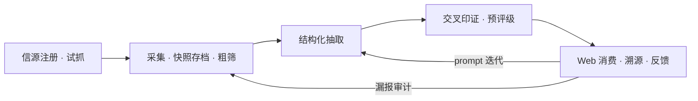

# 情报中心 — 产品 Backlog（需求树）

- 版本：V3.1（折叠 IA：原型 `docs/prototype.html` 为验收参照，IA 约束并入编写约定 §5，验收面映射作 §11 反查表；原文档《Information Architecture.md》已删。承 V3.0 立项口径——「互联网情报闭环」单 Epic 垂直切片承载、人工信源独立 Epic、Agent 消费收未来简表。配合《Project Charter.md》、《Architecture.md》）
- **本文档定位**：需求的事实源与导读。开发前是具体的需求说明；按需求成熟度分层渐进明细，每个可实施故事交付后即是一个用户可感知、可验收、可反馈的增量。本文档不承载实现状态——实现进度由代码与测试反映，需求变更走版本号。

**编写约定**：

1. **结构**：Epic（用户目标）→ Feature（用户能力）→ Story（可验收的用户故事）；
2. **两类需求，不携带排期**：本文档只区分**梳理过的需求**（以 Story 承载；按明细程度分核心闭环——故事句 + 全量 Gherkin AC、已规划——故事句 + 验收要点，AC 的有无即明细标志）与**未分解的未来需求**（仅方向语句入简表，不立 Story）。明细程度不是排序依据，文档不携带阶段 / 优先级等排期暗示——实现顺序由规划决定；
3. **立项门槛——验收面必须是用户界面，Web 为默认**：每条故事必须声明验收面——用户在哪个**界面上**感知并验收它（Web 为默认验收面，CLI 是运维入口而非验收面）。验收面做不到用户界面的需求**不立项**：其要求并入相关故事的 AC，或收进 Epic 级非功能需求（§1.9）。**生产与消费不拆开验收**——闭环是最小的价值单元：Feature 按垂直切片组织，生产侧故事的 AC 落在其消费侧界面上，同一验收面随 Feature 推进逐层加深（如详情页：原文快照 → 结构化分区 → 事件状态与跃迁历史；信源页：状态列表 → 健康标记 → 站内信）；
4. **AC 与测试对接**：Gherkin AC 落 `.feature` 文件，Story ID 作标签（如 `@S1.1.1`），需求→测试双向追溯；实现层工具选型随代码库演进。
5. **IA 约束——原型为验收参照，Backlog 为需求事实源**：交互骨架与信息架构见 `docs/prototype.html`（可点击原型，含七条用户流标注）；原型供结构与跳转对齐，**不承载需求**——需求真伪以本文档 Story AC 为准，方向冲突时本文档赢。IA 形态规则三条：(a) **详情页为聚合面**——列表 / 待处理队列 / 假设证据链三入口汇入同一详情页，随 Feature 逐层加深不新建页面；(b) **核实为情报库内「待处理」视图**——不作顶级页，与「全部」共享列表骨架、仅默认筛选与排序不同；(c) **状态词表跨页一致**——列表 Admiralty 码 / 事件状态列 / 详情跃迁历史 / 待处理视图标签共用同一状态机词表（架构 §6.1）。Dashboard 为观察面，指标随采集能力渐进填充，依赖埋点的标灰、不提前造空壳数据。

---

## 0. 角色模型（Persona）

> 角色按职责定义，是接口而非具体人员——每个角色均可由人或 Agent 承担（立项文档 §1）。

| 角色 | 代号 | 一句话诉求 |
|---|---|---|
| 情报运营者 | **运营者** | "我要能控制情报质量与信源健康，系统别给我添乱" |
| 主动消费者 | **消费者** | "我要能查到可信的竞品情报并直接用于规划——Agent 亦然" |
| 信息贡献者 | **贡献者** | "我参会/访谈得来的信息，30 秒内能丢进系统" |
| 被动消费者（简报读者） | **读者** | "定期给我一份看得懂的简报" |

（初期各角色由同一人承担；Agent 承担消费者 / 贡献者为其自然扩展，对应未分解的未来需求——Agent 同源消费与录入网关。）

---

## EPIC-1 互联网情报闭环

**用户目标**：作为产品规划者，系统替我盯住注册的信源——自动采集、存档原文、结构化出带可信度的情报；我在 Web 上消费它——筛选、溯源、判断可信度、顺手纠错；我登记的假设系统持续替我求证——命中即提醒、证据自动归集，终态由我判断。**生产与消费是这个闭环的两面，不拆开验收。**



Feature 序即闭环逐段点亮的顺序，每个 Feature 是用户可在一个界面上验收的能力状态：

| Feature | 能力状态（用户视角一句话） | 主要验收面 |
|---|---|---|
| F1.1 信源接入与原文可查 | "原文看得到" | Web 信源页（含试抓报告）、列表 / 详情 |
| F1.2 结构化与组合筛选 | "情报读得懂、筛得快" | Web 详情、列表筛选 |
| F1.3 可信度与人工核实 | "结论信得过" | Web 列表 / 详情、核实页 |
| F1.4 消费反馈闭环 | "越用越准" | Web 详情反馈区、聚合页 |
| F1.5 无人值守运行 | "不用我盯" | Web 列表到点更新、站内信、信源页健康标记 |
| F1.6 假设求证 | "我的想法有人持续盯着求证" | Web 假设页（登记 / 证据链 / 结论） |

### F1.1 信源接入与原文可查

#### S1.1.1 信源注册与信源页试抓取

> 作为运营者，我在 repo 的领域包 YAML 中注册信源（URL、类型、层级、频率、列表页入口），在 Web 信源页查看全部信源状态、触发试抓取验证可达性，以便信源配置可信、抓得通才启用——状态与验收都在页面上。

> 验收面：Web 信源页（信源状态列表 + 页内试抓报告）。注册与配置编辑保留在 YAML + Git（版本化留痕，ADR-001）；信源页承载可视、试抓与健康（F1.5 加深健康标记与站内信）。

```gherkin
AC1: Given 运营者在领域包 YAML 中新增信源并提交
     When 流水线加载配置
     Then 缺必填字段时加载被拒绝，指出缺失字段与行号
     And 信源页列出全部信源：名称、类型、层级、可靠性、频率、启用状态

AC2: Given 信源页上某个信源
     When 运营者点击"试抓取"
     Then 页面展示试抓报告（robots / 列表页 / 详情 / 快照 逐项成败）
     And 试抓取通过才将该源 enabled 置 true（enabled 由 YAML 变更、Git 留痕）
     And enabled=false 的源不参与采集

AC3: Given 运营者修改领域包 YAML（信源 / 关键词 / 竞品 / 标签树 / 模板 / 提示词）
     When 重新加载
     Then 采集关键词、抽取标签树、提示词立即按新包生效，核心系统无任何代码变更
```

#### S1.1.2 采集入库与原文可查

> 作为消费者，运营者执行采集后新条目出现在 Web 列表、点开可见原文快照与原始链接，重复采集不产生重复条目、无关内容不混入，以便我不用搬运转录、原文永远找得回。

> 验收面：Web 列表 / 详情（+ 采集统计 CLI 报告）。去重、粗筛、先落盘可重放并入本故事 AC 与 §1.9 NFR，不独立成卡。

```gherkin
AC1: Given 某已启用信源
     When 运营者执行采集
     Then 新内容抓取入库，输出统计「入库 N 新增 / M 幂等跳过 / K 失败」
     And 新条目出现在 Web 列表（标题、信源、采集时间）
     And 详情页提供原文快照与原始链接两个入口（无快照的内容不入库）

AC2: Given 重复采集同一信源而内容未更新
     Then URL 指纹相同或内容相似度超阈值的条目被幂等跳过
     And 情报库行数不变

AC3: Given 一条新内容被粗筛（关键词 + 小模型二分类）判为不相关
     Then 它不进入消费列表，行级标记保留
     And 运营者可在 Web 列表按处理状态筛出复核（漏报审计）

AC4: Given 抓取或处理失败
     Then 原始内容先落盘不丢失，失败原因可查、可重放（细则见 §1.9 与架构 §8）
```

### F1.2 结构化与组合筛选

#### S1.2.1 结构化抽取与详情分区

> 作为消费者，每条入库情报在详情页按 schema 展开结构化分区（主体 / 事件类型 / 事实 / 推断 / 标签 / 量化参数 / Admiralty），抽取明显失败的条目被拦下待人工，以便我读得懂、不被低质条目干扰。

> 验收面：Web 详情页结构化分区（在 S1.1.2 的原文入口之上加深）+ 列表按处理状态筛选。LLM 校验重问、后验质量门并入本故事 AC，不独立成卡。

```gherkin
AC1: Given 一条通过粗筛的内容完成结构化抽取
     When 消费者打开详情页
     Then 展示 主体 / 事件类型 / 标签 / 量化参数 与 Admiralty 码
     And 事实与推断分区展示，推断字段必须含依据

AC2: Given LLM 返回的结构化输出未通过 schema 校验
     Then 自动重问（≤3 次），仍失败则条目降级"待人工"，不丢弃

AC3: Given 抽取结果主体为占位值（未知 / 无 / 不详 / 空）
     Then 条目标记"待人工"，不混入正常情报
     And 可在 Web 列表按处理状态筛出，进入 S1.3.2 核实页
```

#### S1.2.2 多条件组合筛选与浏览

> 作为消费者，我想按 主体 / 事件类型 / 时间范围 / 标签 / 置信度 组合筛选情报列表，以便快速定位某类信息。

> 验收面：Web 列表筛选。

```gherkin
AC1: Given 情报库已有数据
     When 消费者选定 主体 / 事件类型 / 时间范围 / 标签 / 置信度 组合
     Then 列表仅展示同时满足所有条件的情报
     And 每条显示 标题、主体、事件类型、置信度、采集时间

AC2: Given 筛选结果为空
     Then 页面提示无结果，并建议放宽条件
```

### F1.3 可信度与人工核实

#### S1.3.1 交叉印证与可信度呈现

> 作为消费者，每条情报在列表带 Admiralty 码与所属事件核实状态，详情页呈现事件完整跃迁历史，以便我一眼看出可信度、独立判断结论。

> 验收面：Web 列表（Admiralty + 事件状态列）与详情页事件区（在结构化分区之上加深）。聚类与自动跃迁逻辑并入本故事 AC，不独立成卡。

```gherkin
AC1: Given 一条新情报完成处理
     Then 其来源层级自动继承自信源配置，Admiralty 预评级非空（如 B2）

AC2: Given 新情报与已有事件的主体相同、时间窗 ±7 天、内容相似度超阈值
     Then 自动归入该事件
     And 若这是第二个独立信源，事件状态自动跃迁 待核实→单源确认（操作者=system，写日志）
     And 事件标记"已具备升级条件"进入 S1.3.2 核实页（终态不自动跃迁）

AC3: Given 新情报未命中任何已有事件
     Then 新建事件，初始状态=待核实

AC4: Given 列表中一条情报已挂事件
     Then 该条显示所属事件核实状态，未挂事件的情报显示"未挂事件"
     And 详情页展示所属事件的完整状态跃迁历史（自动跃迁标注 system）
```

#### S1.3.2 人工核实页

> 作为运营者，我想在一个 Web 队列页里查看已具备升级条件与待人工的条目，一键确认或证伪，以便控制入库质量、终态由人把关。

> 验收面：Web 核实页（队列 + 确认 / 证伪操作）。积压降级并入 AC4。

```gherkin
AC1: Given 存在需人工处理的情报 / 事件
     When 运营者打开核实页
     Then 按 置信度升序 + 采集时间升序 排列（低置信、最老的优先）
     And 队列含三类：已具备升级条件的事件、低置信度情报、待人工条目（S1.2.1 AC3）

AC2: Given 运营者对"单源确认"事件点击确认
     Then 事件状态跃迁为 多源确认（人工终态），写 verification_log（操作人、时间、原状态、新状态）

AC3: Given 运营者点击证伪并填写理由
     Then 事件状态跃迁为 已证伪，理由写入日志
     And 该事件下情报在检索结果中默认隐藏

AC4: Given 待核实情报持续 7 天无人处理
     Then 其检索权重降级，并在核实页"积压提醒"区列出
```

### F1.4 消费反馈闭环

#### S1.4.1 消费页反馈动作

> 作为消费者 / 运营者，我想在情报详情页对抽取结果一键标记反馈（主体错了 / 事件类型错 / 事实不准 / 不该入库），以便上游处理层提示词 / 粗筛据此迭代，形成人机闭环。

> 验收面：Web 详情页反馈区（按钮 + 表单）。

```gherkin
AC1: Given 消费者打开情报详情页，看到"主体"字段与原文不符
     When 点击"主体错了"反馈按钮
     Then 可填正确主体（从主体清单选或自由输入）
     And 反馈记录写入 feedback 表（item_id, field=subject, wrong_value, correct_value, user_id, ts）

AC2: Given 消费者看到事实描述不准
     When 点击"事实不准"反馈按钮
     Then 可选择具体哪条事实并填说明
     And 反馈标注到具体事实项级别

AC3: Given 消费者认为事件类型标错
     When 点击"事件类型错"反馈按钮
     Then 可选正确事件类型，反馈写入 feedback 表

AC4: Given 消费者认为这条不该入库（粗筛漏放）
     When 点击"不该入库"反馈按钮
     Then 反馈写入 feedback 表（type=should_filter）
     And 该信号聚合到粗筛漏报审计（与 S1.1.2 AC3 互补）
```

#### S1.4.2 反馈聚合与迭代驱动

> 作为运营者，我想查看反馈聚合视图，某类反馈高频时高亮提示迭代，反馈可导出为 prompt few-shot 样本，以便反馈真正驱动抽取 / 粗筛改进。

> 验收面：Web 反馈聚合页 + JSONL 导出。

```gherkin
AC1: Given 运营者查看反馈聚合页
     When 某信源某类反馈高频出现（如主体错误率 >30%）
     Then 视图高亮提示需迭代该信源的抽取 prompt 或调整粗筛阈值

AC2: Given 运营者需用反馈改进提示词
     When 导出反馈
     Then 反馈条目可导出为处理层 prompt 迭代的 few-shot 样本（JSONL）
```

### F1.5 无人值守运行

#### S1.5.1 自动采集到点可见

> 作为消费者，注册信源按其频率自动更新，我什么都不做——到点打开 Web 列表就出现新情报（带采集时间戳），以便真正省去盯源与手动触发的机械工作。

> 验收面：Web 列表到点自动出现新条目（无需任何人运行命令）。

```gherkin
AC1: Given 信源配置频率为每日且已启用
     When 调度时间到达
     Then 系统自动抓取新内容并生成原文快照
     And 新条目出现在 Web 列表（S1.1.2 的全部 AC 对调度触发同样成立）
     And 无快照的内容不进入后续流水线

AC2: Given 抓取失败（网络 / 反爬）
     Then 按指数退避重试 3 次，仍失败计入信源健康统计（触发 S1.5.2 告警）
```

#### S1.5.2 信源健康告警（站内信）

> 作为运营者，某信源抓取连续失败时我在 Web 收到站内信告警、信源页标记异常且不影响其他信源采集，以便保持采集不断流、系统不给我添乱。

> 验收面：Web 站内通知（未读标记 + 通知列表，含信源名与失败原因）+ 信源页健康标记。外部渠道（企业微信 / 邮件）为可配置扩展渠道，不在本故事范围。

```gherkin
AC1: Given 某信源连续 3 次抓取失败
     Then 运营者打开 Web 可见未读站内信（含信源名与失败原因）
     And 信源页该源标记"异常"
     And 其他信源采集不受影响

AC2: Given 运营者查看站内信
     Then 通知可标记已读，历史通知可查
```

### F1.6 假设求证

#### S1.6.1 假设登记与证据自动归集

> 作为消费者，我把产品假设（如"三一 Q4 将发布遥控版"）登记进系统，系统持续用新入库情报匹配它、命中自动挂为证据并提醒我，以便假设不再散落遗忘、求证不靠人脑反复盯。

> 验收面：Web 假设页（登记表单 + 假设列表 + 证据链视图）。假设匹配节点并入流水线（复用事件聚类的匹配键：主体 × 时间窗 × 相似度），不独立成卡。

验收要点：
1. 登记字段：假设陈述（自然语言）+ 主体 + 事件类型 + 时间窗 + 关键词（后四项可由 LLM 从陈述预填、人工确认）；
2. 登记时回扫存量：情报库中已有的匹配情报立即挂为初始证据（不等新采集）；
3. 新情报入库时自动匹配活跃假设（匹配键与事件聚类一致），命中即挂接为证据（多对多），假设页证据链展示 情报摘要 + 置信度 + 采集时间，点击跳详情；
4. 命中产生站内信提醒（复用 S1.5.2 通知机制）；
5. 假设状态可见：待求证（活跃）/ 已证实 / 已证伪 / 已失效。

#### S1.6.2 假设结论与反哺

> 作为消费者，我在证据充分时对假设标记结论（证实/证伪，须填依据），超时未决自动失效归档，以便判断留痕可复盘、结论反哺监控方向。

> 验收面：Web 假设页结论操作 + 结论复盘视图（周报复盘节）。

验收要点：
1. 结论（已证实/已证伪）为人工终态，填写依据与结论时间，全程留痕（与事件核实同一纪律）；
2. 时间窗到期未决 → 自动转"已失效"，不删除、可复盘；
3. 结论是判断层知识资产：结论（含依据与证据链）可检索、可引用，可挂为新假设的证据；不回写情报表（事实/判断两层分治，见立项文档 §3）；
4. 结论反哺：已证实/已证伪假设的关键词进入周报复盘节，驱动监控关键词与信源调整建议（提示运营者，不自动改配置——人是最终环节）。

### 1.9 非功能需求（贯穿 EPIC-1，不独立成卡）

> 以下为无独立用户验收面的流水线内建要求，由上述故事的 AC 与架构共同承载，细则见架构 §1 贯穿性约束与 §8 可靠性表：

- **可回溯**：无快照不入库；每条情报可追溯原文快照与来源；
- **可靠性**：原始内容先落盘、处理永远可重放；死信（重试耗尽）可查失败原因、可重放、可丢弃留痕；LLM 调用重试 + 结构化校验失败自动重问、持续失败降级待人工不丢弃；
- **幂等**：内容指纹唯一约束，重复抓取 / 重复投递不产生重复条目；
- **终态人工**：事件终态（`多源确认` / `已证伪`）与假设终态（`已证实` / `已证伪`）必须人工触发，自动跃迁全程写日志（操作者=system）；
- **合规**：遵守 robots 协议；快照仅内部留存，对外分享仅给链接与摘要。

---

## EPIC-2 人工信源纳入

**用户目标**：作为贡献者，我参会 / 访谈得来的见闻能快速进入系统并自动结构化，不流失——与互联网情报同一套核实、消费与反馈体系。

### F2.1 统一录入入口

#### S2.1.1 统一录入入口

> 作为贡献者，我想把文本 / 文件 / 录音丢进一个入口，30 秒内完成，系统自动结构化入库，以便我的见闻不流失。

> 验收面：录入入口（Web 页面）+ 录入后条目出现在 Web 列表并走完与互联网情报相同的处理链。

验收要点：
1. 单次录入 ≤30 秒；
2. 走与自动采集同一流水线（来源类型=人工，来源可靠性默认 A/B 级，仍需事实核查）；
3. 自动结构化复用同一抽取链；录入情报同样进事件聚类、人工核实页，可在 Web 消费并反馈——与互联网情报同一质量闭环，无差异对待。

（录音转写、会议纪要结构化、录入激励与流转机制等子能力待梳理时渐进明细为独立故事。）

---

## 未分解的未来需求（简表）

> 以下需求尚未梳理，仅记方向与对应需求章节；待梳理时再分解为可感知、可验收、可反馈的 Story。实现优先级由规划决定。

| 方向 | 一句话 |
|---|---|
| Agent 同源消费 | 只读 JSON API 按与 Web 相同条件组合查询情报（同源同序、凭据鉴权），供 Agent 程序化消费而非解析网页 |
| 自然语言问答 | 带引用的 RAG 问答 + 多轮追问，答案强制附情报 ID / 来源 / 置信度，无可靠情报时如实回答不编造 |
| 竞品功能 / 参数矩阵 | 竞品 × 功能项对比表（有 / 无 / 规划中）+ 关键性能参数表，单元格关联支撑情报 |
| 竞品档案页 | 每个竞品主体一页：基本信息 + 情报聚合 |
| 周报 / 月报 | 定期简报（动态分组 + 趋势归纳 + 弱信号），无新情报仍推送不静默 |
| 重大事件即时推送 | L1 信源重大事件（新品 / 中标 / 人事）完成入库后 30 分钟内推送，同事件多源不重复 |
| 专题调研 | 发起专题任务（如"3D 引导系统竞品对比"），智能体限时深挖产出报告；可由假设升级触发（F1.6 求证意图的深挖出口） |
| 信源画像页 | 基于核实历史重估来源可靠性（被证伪率 / 首发率 / 覆盖领域） |
| 过期时效治理 | 超有效期情报自动降权 + 复核提醒，列表显式标识并排序靠后 |

---

## 11. IA 验收面映射（反查表）

> 原型（`docs/prototype.html`）页面 ↔ Story 验收面反向索引。开发时查"这条故事验收面在哪页"、或"原型这页挂哪些 AC"。需求真伪仍以各 Story 的 AC 为准。

| 原型页面 | 一句话职责 | 承载的 Story 验收面 |
|---|---|---|
| 情报库·列表（全部） | 组合筛选 + 置信度排序浏览，到点出现新条目 | S1.1.2 / S1.2.2 / S1.5.1 |
| 情报库·列表（待处理） | 核实队列视图：三类待处理，确认或证伪 | S1.3.2 |
| 情报库·详情 ◇聚合面 | 原文快照 + 结构化分区 + 事件核实历史 + 反馈动作 | S1.1.2 / S1.2.1 / S1.3.1 / S1.4.1 |
| 假设·列表 | 按状态浏览假设 | S1.6.1 |
| 假设·详情 | 登记表单 + 证据链 + 结论操作 | S1.6.1 / S1.6.2 |
| 录入 | 文本/文件/录音统一入口，≤30s 入库 | S2.1.1 |
| 信源 | 状态列表 + 试抓报告 + 健康标记 | S1.1.1 / S1.5.2 |
| 反馈聚合 | 反馈高频高亮 + JSONL 导出 | S1.4.2 |
| Dashboard | 北极星指标与系统健康常驻可见 | Charter §7 / §1.9 |
| 站内信（右上角铃铛） | 浮层 + 历史页，命中/告警/积压统一入口 | S1.5.2 / S1.6.1 |

七条用户流（原型黄条标注）：F-A 日常监控 · F-B 录入 · F-C 按需检索（北极星落点）· F-D 假设求证 · F-E 信源管理 · F-F 人工核实 · F-G 反馈迭代。

---

## 迁移与演进约定

- **管理工具未定**。选型要求：支持树形结构（Epic → Feature → Story）、稳定编号与自动变更历史（条目移动 / 拆分不改号，即分配制键）、条目间链接语义（拆分至 / 并入）、状态流转；
- **事实源**：工具选定前，本文档为唯一事实源；选定后，状态与讨论迁至工具，本文档保留结构、AC 与编号对照；
- **编号纪律——编号是身份，不是地址**：编号在立卡时分配、此后冻结——移动、重组不改号（编号描述出生位置，当前位置以文档结构为事实源）；编号一旦被代码 / 测试 / ADR 引用即成为追溯锚点，重编号只发生在需求树重立且旧引用全仓清零时（本版即此类重立）；
- **拆分与合并**：拆分——父卡标记「已废弃（拆分至 S… / S…）」压缩为存尸行，子卡取新号；合并——保留一张卡，其余标记「已废弃（并入 S…）」；废弃卡不删除、不复用、编号永不回收；
- **变更历史**：留痕走 Git——每次改卡的 commit 首行带编号（如 `backlog: S1.2.1 扩充 AC3`），`git log --grep` 即单卡完整变更史；文档内存尸行负责可见性，Git 负责可追溯深度；
- **实现状态**：本文档不承载交付状态，实现进度由代码与测试反映；需求口径与结构变更（含拆 / 并 / 移）走文档版本号。
