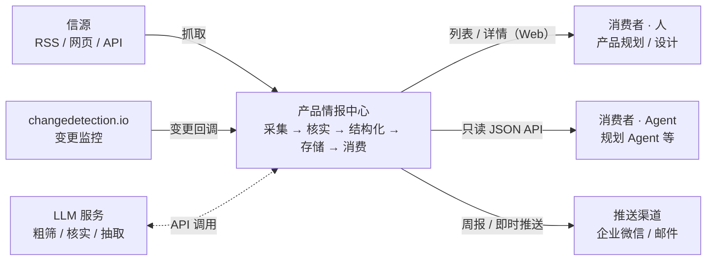
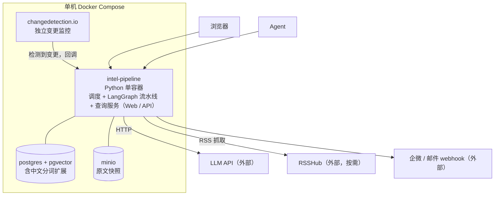
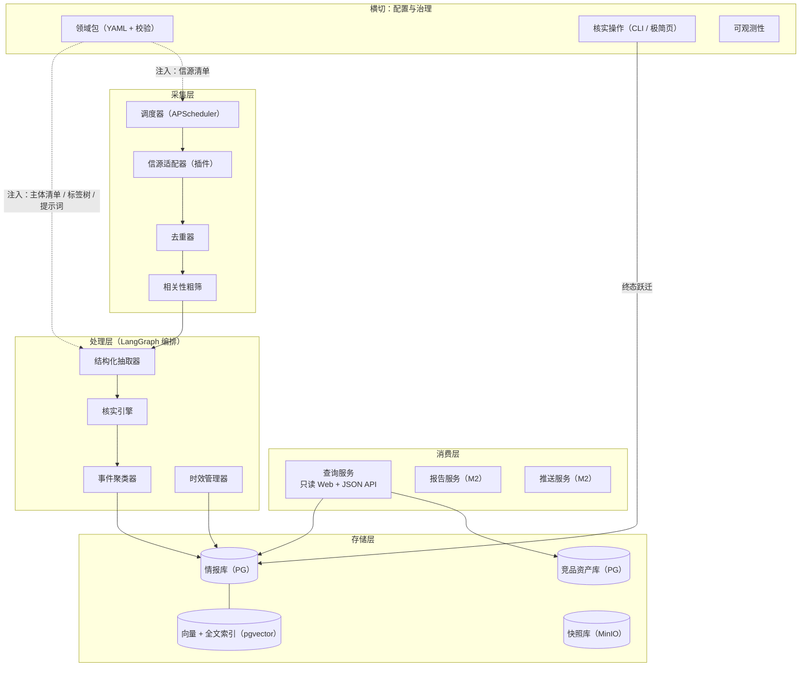
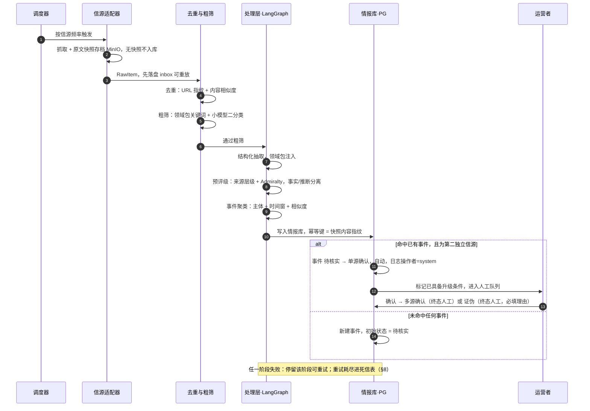
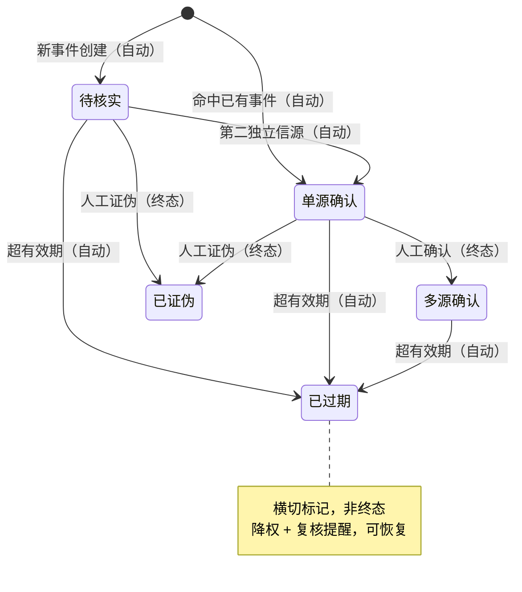
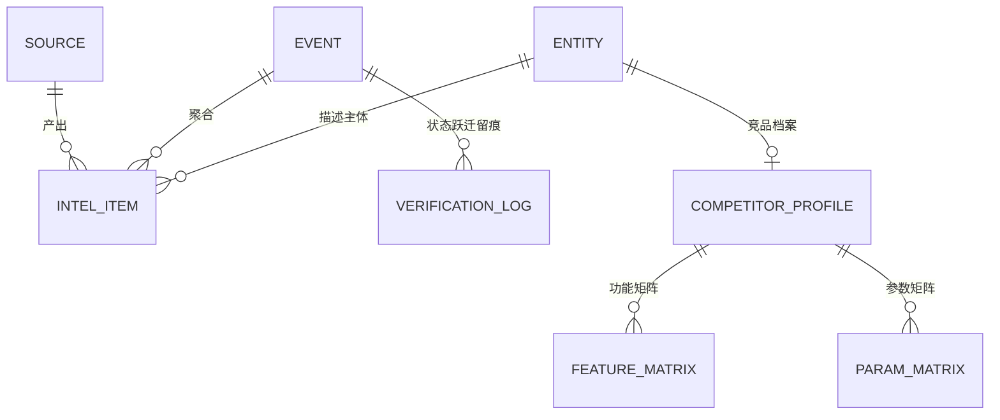
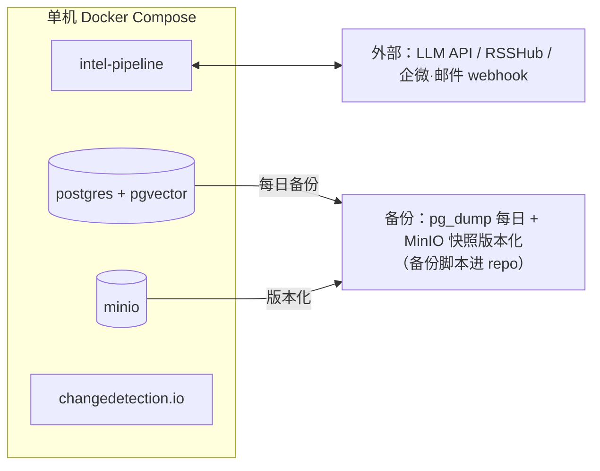

# 架构文档修订实施计划（ADR 拆分 + 分层重构）

> **For agentic workers:** REQUIRED SUB-SKILL: Use superpowers:subagent-driven-development (recommended) or superpowers:executing-plans to implement this plan task-by-task. Steps use checkbox (`- [ ]`) syntax for tracking.

**Goal:** 将 13 个内嵌 ADR 精简为 7 个独立 ADR 文档（`docs/adr/`），并把 `docs/Architecture.md` 重构为十节分层结构（全部图 mermaid 化），同步 Backlog 与需求文档中的引用。

**Architecture:** 纯文档重构，无代码。输入 = 现有 `docs/Architecture.md`（V0.6，含 13 个内嵌 ADR）；产物 = 7 个新 ADR 文件 + 重写的 Architecture.md + 两份文档的引用同步。旧 ADR 编号到新编号的映射在执行中一次性完成，不保留映射史。

**Tech Stack:** Markdown + mermaid（GitHub 原生渲染，不引入渲染工具链）。

**规格:** `docs/superpowers/specs/2026-08-25-architecture-revamp-design.md`（已批准）

## Global Constraints

- 全部文档中文，风格**简洁精炼**——宁短勿长，每句话承载信息；
- ADR 统一模板：`状态/日期 → 问题 → 可选方案（各含优缺点）→ 决策 → 理由 → 后果`；
- 新 ADR 编号 001–007 即**最初版**，文内不出现"原 ADR-0XX"字样；
- Architecture.md 十节结构（§1 概览 / §2 系统上下文 / §3 容器视图 / §4 逻辑架构 / §5 核心数据流 / §6 核心设计 / §7 数据架构 / §8 可靠性与可观测 / §9 部署架构 / §10 ADR 索引），共 ≥5 个 mermaid 图，**禁止 ASCII 图**；
- 删除原 §8（Backlog 推导建议）与原 §9（架构风险表）——内容分别以 Backlog 文档、需求文档 §7 为唯一归属；
- 提交信息用中文 `docs:` 前缀，末尾加 `Co-Authored-By: Claude Fable 5 <noreply@anthropic.com>`；
- 每个任务独立提交；引用同步（Task 4）必须在 Architecture.md 重写（Task 3）之后，避免中间态引用悬空。

**旧→新编号映射（执行参照，不写入产物）：**

| 旧 | 新 | 旧 | 新 |
|---|---|---|---|
| 旧001 领域包 | 新ADR-001 | 旧009 单PG | 新ADR-005（并入011） |
| 旧002 两段式 | 新ADR-002 | 旧011 混合检索 | 新ADR-005 |
| 旧004 事件/情报分离 | 新ADR-003 | 旧007 极简Web + 旧013 同源 | 新ADR-006 |
| 旧006 LangGraph | 新ADR-004 | 旧012 at-least-once | 新ADR-007 |
| 旧003 Admiralty | 正文 §6.2 | 旧005 快照 | 正文 §5.3 |
| 旧008 分级调用 | 正文 §9.2 | 旧010 人工同管道 | 正文 §4 模块表 |

**章节号映射（跨文档引用更新参照）：** 状态机 旧§4.2→新§6.1；排序函数 旧§4.3→新§6.2；可靠性 旧§5A→新§8；部署 旧§6→新§3/§9。

---

### Task 1: 创建 ADR-001 ~ ADR-003（领域包 / 两段式核实 / 事件情报分离）

**Files:**
- Create: `docs/adr/ADR-001-领域包为配置而非插件机制.md`
- Create: `docs/adr/ADR-002-核实采用两段式.md`
- Create: `docs/adr/ADR-003-事件与情报分离建模.md`

**Interfaces:**
- Consumes: 旧 `docs/Architecture.md` §7 ADR-001/002/004 的语义（文件仍在磁盘，勿删）
- Produces: 三个 ADR 文件，后续 Architecture.md §10 索引表按本任务的文件名建立链接

- [ ] **Step 1: 写入 ADR-001**

写入 `docs/adr/ADR-001-领域包为配置而非插件机制.md`，全文如下：

```markdown
# ADR-001：领域包为配置而非插件机制

- 状态：已接受
- 日期：2026-08-25

## 问题

系统需支持从挖机智能化扩展到任意产品线，但当前仅有 1 个领域样本。行业知识（信源、关键词、竞品、标签树、报告模板、抽取提示词）以什么形态进入系统，才能既支撑未来多领域，又不为想象中的需求支付维护成本？

## 可选方案

### 方案 A：完整插件机制（领域包自带代码）

- 优点：扩展能力最强，复杂领域逻辑可随包分发
- 缺点：单领域样本下无法证伪通用性设计；插件 API 的维护与兼容成本立即发生；抽象错了很难收回

### 方案 B：repo 内 YAML 配置 + schema 校验

- 优点：切换/新增领域 = 改配置不改代码；抽象风险被限制在配置层；可 Git 评审与版本化
- 缺点：领域逻辑无法自带代码，超出配置表达力的需求需进核心

## 决策

采用方案 B。核心只定义 主体—事件—情报—来源—置信度 五元模型；行业知识全部封装为领域包（YAML + schema 校验，缺必填字段拒绝加载）。插件化推迟到第二个领域包真实接入之后。

## 理由

1. rule of three 未满足——仅 1 个领域样本，插件机制的通用性设计无法被证伪；
2. 1 人开发约束下，配置层的维护成本远低于插件 API 的兼容承诺；
3. 领域包内容（清单/词表/模板/提示词）天然是数据而非逻辑，YAML 表达力足够。

## 后果

- 切换/新增领域 = 改 YAML，核心代码零变更；
- 通用性验收推迟到第二领域真实接入；Sprint 0 Spike ④ 以物流机器人领域纸面套模，记录五元模型覆盖缺口；
- 领域包 YAML schema 定义与加载器是最优先技术任务。
```

- [ ] **Step 2: 写入 ADR-002**

写入 `docs/adr/ADR-002-核实采用两段式.md`，全文如下：

```markdown
# ADR-002：核实采用两段式——AI 预核实 + 人工终核

- 状态：已接受
- 日期：2026-08-25

## 问题

全自动核实不可靠（错误情报会污染下游检索与决策），全人工不可持续（1 人运营）。核实状态跃迁的自动化边界划在哪？

## 可选方案

### 方案 A：全自动状态跃迁

- 优点：零人工成本
- 缺点：错误情报自动获得高信任等级，污染下游检索——信任崩塌则系统失去存在意义

### 方案 B：全人工跃迁

- 优点：质量完全可控
- 缺点：1 人运营下核实队列必然积压，情报时效性丢失

### 方案 C：两段式——AI 预核实 + 人工终核

- 优点：人工精力集中于价值最高的终态判断；中间态零积压
- 缺点：仍需人工队列治理（积压自动降级）配套

## 决策

采用方案 C。中间态（待核实 → 单源确认）自动流转；两个终态（多源确认 / 已证伪）必须人工操作；全部跃迁写 verification_log（自动跃迁操作者 = system）。

## 理由

1. 信任是系统价值的前提，终态代表"可进决策"的信任等级，必须由人背书；
2. 中间态跃迁条件客观（是否出现第二独立信源），机器判定可靠；
3. 人工预算只够花在刀刃上——终态判断正是刀刃。

## 后果

- 核实操作（CLI/极简页）为 P0 交付项；
- 积压治理（待核实超 7 天自动降级）进入需求；
- verification_log 同时成为未来信源画像的数据底座。
```

- [ ] **Step 3: 写入 ADR-003**

写入 `docs/adr/ADR-003-事件与情报分离建模.md`，全文如下：

```markdown
# ADR-003：事件与情报分离建模，核实状态挂事件层

- 状态：已接受
- 日期：2026-08-25

## 问题

同一事件常有多信源报道，需交叉印证（双独立信源方可升级）。核实状态应挂在情报条目层还是事件层？

## 可选方案

### 方案 A：状态挂情报条目，事件仅作分组标签

- 优点：建模简单，无需聚类先行
- 缺点：同一事件下两条目状态可互相矛盾，"多源确认"语义无法自洽，交叉印证无从谈起

### 方案 B：事件聚合情报，核实状态挂事件层

- 优点：状态唯一且自洽；"多源确认 = 事件获得双独立信源"语义直接可判定
- 缺点：去重/事件聚类必须成为独立模块（额外工作量）

## 决策

采用方案 B。情报（intel_item）挂来源，事件（event）聚合情报；核实状态记在事件层，条目不持有独立状态；条目详情页展示"所属事件状态 + 本条目核实日志"。

## 理由

1. 交叉印证是核实方法论的核心，方案 A 使其语义不自洽，直接不可用；
2. 去重与聚类本就是流水线必需能力（否则同事件重复入库），该缺点的大部分成本已注定发生。

## 后果

- 事件聚类器成为处理层独立模块；M1 用简版（主体 + 时间窗 + 相似度阈值），人工可合并/拆分；
- 所有状态跃迁统一走状态机模块入口并全部留痕，禁止绕过。
```

- [ ] **Step 4: 校验模板一致性**

Run: `grep -c "^## " docs/adr/ADR-00[1-3]*.md && grep -L "## 后果" docs/adr/ADR-00[1-3]*.md; echo done`
Expected: 每个文件 `## ` 标题数为 5（问题/可选方案/决策/理由/后果）；`grep -L` 输出空 + `done`（三个文件都含后果节）。

- [ ] **Step 5: 提交**

```bash
git add docs/adr/
git commit -m "docs: ADR 001-003（领域包配置化 / 两段式核实 / 事件情报分离）

Co-Authored-By: Claude Fable 5 <noreply@anthropic.com>"
```

---

### Task 2: 创建 ADR-004 ~ ADR-007（LangGraph / 单 PG 检索 / 消费端同源 / at-least-once）

**Files:**
- Create: `docs/adr/ADR-004-流水线编排代码化.md`
- Create: `docs/adr/ADR-005-单一PostgreSQL承载混合检索.md`
- Create: `docs/adr/ADR-006-消费端Web与API同源.md`
- Create: `docs/adr/ADR-007-流水线可靠性语义.md`

**Interfaces:**
- Consumes: 旧 `docs/Architecture.md` §7 ADR-006/009/011/007/013/012 的语义
- Produces: 四个 ADR 文件；Architecture.md §10 索引表与 §3/§4/§8/§9 的行内引用使用这些编号

- [ ] **Step 1: 写入 ADR-004**

写入 `docs/adr/ADR-004-流水线编排代码化.md`，全文如下：

```markdown
# ADR-004：流水线编排代码化——LangGraph，不引入低代码平台

- 状态：已接受
- 日期：2026-08-25

## 问题

采集调度与 LLM 处理流水线（粗筛/抽取/评级/聚类/后续 RAG）的宿主形态：低代码平台还是代码？立项早期曾拟用 Dify 编排 + n8n 采集，资源假设确立为 1 人开发运维后需重估。

## 可选方案

### 方案 A：n8n + Dify 低代码栈

- 优点：可视化画布，起步快，无需写编排代码
- 缺点：合计 6 个自部署组件，1 人运维不可持续；工作流无法进 pytest/CI 门禁，与 Backlog 的 Gherkin→CI 约定直接冲突；平台绑定，迁移成本随用量增长

### 方案 B：n8n 采集 + 代码处理混合

- 优点：采集侧省代码
- 缺点：两套心智模型，职责边界模糊，排障跨两个世界

### 方案 C：全代码——LangGraph 编排 + APScheduler 进程内调度

- 优点：可测试、可版本化、可 review；自部署容器 6→4；模型端点可配置不受平台限制
- 缺点：编排代码需自写（AI 辅助开发显著拉低此成本）

## 决策

采用方案 C。处理层全部 LLM 任务以 LangGraph 图实现——LLM 任务一个不少，宿主从可视化画布换为代码；采集调度用 APScheduler 进程内调度。

## 理由

1. 1 人运维约束：组件数与可排障性压倒起步速度；
2. CI 门禁要求流水线可测试——低代码工作流进不了 pytest；
3. AI 辅助开发使"平台省开发"的优势大幅缩水；
4. 语义能力不受影响：LLM 节点在代码中同为第一公民，端点可配置（支持自有模型服务）。

## 后果

- 全部流水线可测试、可版本化、可 review；Dify 绑定风险消失；
- 图结构保持扁平（M1 一条主链，无复杂分支），控制学习与调试成本；
- Sprint 0 Spike ③ 验证 LangGraph + 自有模型服务连通性。
```

- [ ] **Step 2: 写入 ADR-005**

写入 `docs/adr/ADR-005-单一PostgreSQL承载混合检索.md`，全文如下：

```markdown
# ADR-005：单一 PostgreSQL 承载混合检索

- 状态：已接受
- 日期：2026-08-25

## 问题

检索需同时覆盖两类典型查询——语义型（"遥控功能迭代史"）与精确型（竞品型号"SY375"）。检索基础设施（BM25 关键词 + 向量）放在哪？M1 数据量 < 10 万条。

## 可选方案

### 方案 A：独立向量库（Qdrant/Milvus）+ 独立全文引擎（ES）

- 优点：大规模场景成熟，检索能力上限高
- 缺点：M1 规模下纯增自部署组件，1 人运维约束下不可接受

### 方案 B：纯向量检索（单库 pgvector）

- 优点：组件最少
- 缺点：中文精确 token（竞品型号如 SY375）召回弱，精确型查询直接失效

### 方案 C：单一 PG——pgvector + PG 中文全文检索（zhparser/pg_jieba）

- 优点：混合检索在单库内闭环，union/filter/rerank 在一个 SQL 内完成；不新增运维组件
- 缺点：超大规模需迁移（以检索接口抽象对冲）；中文分词扩展有安装维护成本

## 决策

采用方案 C。M2 RAG 采用两路召回（PG 中文全文 BM25 ∪ pgvector 向量）+ 结构化过滤 + 统一重排（架构 §6.2 排序函数）；两路权重为领域包可调参数；检索接口抽象，后续可平滑切换 Qdrant/ES。

## 理由

1. 两类查询形态都必须覆盖——纯向量方案直接否决；
2. M1 规模远未到需要独立检索集群的量级；
3. 混合检索逻辑收在单库内，实现与排障复杂度最低。

## 后果

- 中文分词扩展（zhparser/pg_jieba）安装维护列为实施风险，备选方案：应用层 jieba 预分词存 tsvector，牺牲实时性换零扩展依赖；
- 检索接口必须抽象，pgvector/全文 SQL 细节不得散落业务代码。
```


- [ ] **Step 3: 写入 ADR-006**

写入 `docs/adr/ADR-006-消费端Web与API同源.md`，全文如下：

```markdown
# ADR-006：消费端——极简只读 Web 与 JSON API 同源交付

- 状态：已接受
- 日期：2026-08-25

## 问题

消费者角色的承担者不限于人——Agent（如产品规划 Agent）需程序化消费情报库。M1 消费端以什么形态交付，才能同时满足人（详情页 AC：引用跳转、核实历史、快照入口）与 Agent（结构化查询）？

## 可选方案

### 方案 A：Dify 聊天界面 + 飞书多维表格

- 优点：零前端开发
- 缺点：交付不了详情页 AC；Agent 只能解析页面，脆弱且不可持续

### 方案 B：完整自研 Web（前后端分离）+ 独立 API 服务

- 优点：体验上限高
- 缺点：M1 单用户下过度设计；两套查询逻辑必然漂移；1 人运维多一个组件

### 方案 C：单一 FastAPI 应用双出口——服务端模板 Web + 只读 JSON API

- 优点：约 3–5 人日；过滤/排序/引用拼装共用一套逻辑，Web 与 API 结果天然一致；Agent 接入零额外开发
- 缺点：Web 交互上限受服务端模板约束（M1 只读场景无此需求）

## 决策

采用方案 C。查询服务为单一事实源，Web 页面与 JSON API 是同一 FastAPI 应用的两类出口，共用结构化过滤、score 排序与引用拼装。M1 API 只读（筛选列表 + 详情，REST），鉴权从简（内网 + 静态 token），权限体系为后续方向；Agent 贡献者线索回写复用人工录入网关，M1 仅预留接口不交付。

## 理由

1. 北极星指标（检索次数）按 Web/API 分别计数，同源使口径天然一致；
2. S1.1.x / S1.2.x 全部 AC 可交付；
3. 1 人运维约束下不新增任何组件。

## 后果

- 检索体验（北极星指标载体）有保障；
- 后续 Web 化演进（核实操作页、RAG 问答）在同一应用内叠加。
```

- [ ] **Step 4: 写入 ADR-007**

写入 `docs/adr/ADR-007-流水线可靠性语义.md`，全文如下：

```markdown
# ADR-007：流水线可靠性——at-least-once + 幂等处理

- 状态：已接受
- 日期：2026-08-25

## 问题

无人值守流水线必须回答：LLM 调用失败、处理中途崩溃、内容重复投递时——数据会丢吗？状态会错吗？

## 可选方案

### 方案 A：fire-and-forget

- 优点：实现最简
- 缺点：失败即丢，与"无快照不入库"的严谨性矛盾，情报覆盖出现静默空洞

### 方案 B：恰好一次投递（exactly-once）

- 优点：语义最理想
- 缺点：分布式语义复杂，单机规模下为不存在的问题付复杂度

### 方案 C：at-least-once + 幂等处理

- 优点：任何失败可重放、不丢数据；实现复杂度与单机规模匹配
- 缺点：需为各阶段设计幂等键，正确性依赖去重保证

## 决策

采用方案 C。核心原则：原始内容先落盘 inbox，处理永远可以重放。各阶段幂等（入库幂等键 = 快照内容指纹）；LLM 调用重试 ×3 + 结构化输出校验失败自动重问，持续失败降级"待人工"不丢弃；重试耗尽进死信表（CLI 可查看/重放/丢弃）；状态跃迁统一走状态机入口并全部留痕。

## 理由

1. 重试与死信是无人值守系统的默认设计而非补丁；
2. 落盘重放使"任一阶段失败"退化为"该阶段重跑"，无需分布式事务。

## 后果

- 各环节失败处理语义详见架构文档 §8（可靠性与可观测）；
- 死信可见性（Backlog S1.1.3）为 P0 交付项。
```

- [ ] **Step 5: 校验模板一致性**

Run: `grep -c "^## " docs/adr/ADR-00[4-7]*.md && grep -L "## 后果" docs/adr/ADR-00[4-7]*.md; echo done`
Expected: 每个文件 `## ` 标题数为 5；`grep -L` 输出空 + `done`。另运行 `grep -rn "rerant" docs/adr/` 确认无输出。

- [ ] **Step 6: 提交**

```bash
git add docs/adr/
git commit -m "docs: ADR 004-007（LangGraph 编排 / 单 PG 混合检索 / 消费端同源 / at-least-once）

Co-Authored-By: Claude Fable 5 <noreply@anthropic.com>"
```

---

### Task 3: 重写 Architecture.md 为十节分层结构（mermaid 化）

**Files:**
- Modify: `docs/Architecture.md`（全文重写，旧内容先读一遍作迁移来源，写完后旧结构不再保留）

**Interfaces:**
- Consumes: Task 1/2 的 7 个 ADR（§10 索引链接到 `adr/ADR-00X-*.md` 相对路径）；旧 Architecture.md 各节内容（迁移来源，行号见步骤）
- Produces: `docs/Architecture.md` V0.7，Backlog 与需求文档在 Task 4 中引用其 §6.1/§6.2/§8/§9.2 章节号

**迁移总表（旧文行号 → 新文位置）：**

| 旧内容（行号） | 去向 |
|---|---|
| §1 愿景与四约束（L9–18） | 新 §1（约束 3 内部引用改"见 §6.1"） |
| §2 系统上下文（L22–39） | 新 §2 + mermaid |
| §6 部署架构（L169–178） | 拆入新 §3（容器职责）与 §9（部署与成本） |
| §3 逻辑架构图表（L43–82） | 新 §4 + mermaid；模块表改动见 Step 2 |
| §4.1 主流程（L88–99） | 新 §5.1 + sequence 图 |
| §4.3 检索流程与排序函数（L120–139） | 拆入新 §5.2（流程）与 §6.2（排序函数） |
| ADR-005 快照语义（L210–214） | 新 §5.3 |
| §4.2 状态机（L101–118） | 新 §6.1 + stateDiagram |
| ADR-003 Admiralty（L198–202） | 新 §6.2 前半 |
| ADR-001 领域包细节（L184–190） | 新 §6.3（决策指向 ADR-001） |
| §5 数据架构（L142–148） | 新 §7 + erDiagram |
| §5A 可靠性（L152–165） | 新 §8 |
| ADR-008 分级调用与成本（L230–234） | 新 §9.2 |
| §7 ADR 全部 | 已由 Task 1/2 取代；新 §10 仅留索引表 |
| §8 Backlog 推导（L267–286） | **删除**（归属 Backlog 文档） |
| §9 架构风险表（L290–300） | **删除**（归属需求文档 §7；zhparser 风险已进 ADR-005，备份语义进新 §9.2） |

- [ ] **Step 1: 写入 §1–§5**

用 Write 覆盖 `docs/Architecture.md`，写入以下内容（`【迁移】`标记处按迁移总表从旧文复制并做指明修改，**迁移后删除标记注释**）：

````markdown
# 产品情报中心（Product Intelligence Hub）架构设计

- 版本：V0.7（分层重构稿；ADR 拆分至 docs/adr/）
- 日期：2026-08-25
- 配套：《Product Requirements.md》V0.8、《情报中心-Backlog.md》V0.7
- 用途：指导 Backlog 梳理与模块设计；关键决策记录见 §10 索引

## 1. 概览

**一句话**：一条"采集 → 核实 → 结构化 → 存储 → 消费"的情报流水线，核心域模型行业无关，行业知识以领域包（Domain Pack，repo 内 YAML 配置）注入。

**四条贯穿性约束**（所有模块设计不得违反）：

1. **通用性在模型层，不在业务层**：核心代码不出现任何"挖机/工程机械"字样，行业知识全部来自领域包配置；
2. **一切 AI 产出可回溯**：每条入库情报必须能追溯到原文快照与来源，无快照不入库（§5.3）；
3. **人是核实的最终环节**：AI 只做预核实与分级；`多源确认` 与 `已证伪` 两个**终态**的跃迁必须经人工，中间态可自动流转（§6.1）；
4. **1 人可运维**：系统须可被 1 人监控、修复、恢复——每个自部署组件都占用升级/备份/排障精力，引入须论证；优先可测试的代码资产，拒绝工作流黑盒。

**技术栈一览**：

| 关注点 | 选型 | 决策记录 |
|---|---|---|
| 语言/运行时 | Python 单应用 | — |
| 流水线编排 | LangGraph（LLM 任务节点化） | ADR-004 |
| 采集调度 | APScheduler（进程内） | ADR-004 |
| 查询服务 | FastAPI：服务端模板 Web + JSON API 同源 | ADR-006 |
| 主存储 | PostgreSQL + pgvector + 中文全文（zhparser/pg_jieba） | ADR-005 |
| 对象存储 | MinIO（原文快照） | §5.3 |
| 变更监控 | changedetection.io（独立容器，回调流水线） | §3 |
| 行业知识 | 领域包 YAML + schema 校验 | ADR-001 |
| 部署 | 单机 Docker Compose | §9 |

## 2. 系统上下文



外部依赖三类：信源、LLM API、推送渠道。消费方为消费者角色，承担者为人（Web）或 Agent（只读 API，ADR-006）。文件与人工录入、Agent 贡献者回写为后续方向，M1 仅预留接口（§4）。无其他系统耦合，可独立部署演进。

## 3. 容器视图



| 容器 | 职责 | 说明 |
|---|---|---|
| intel-pipeline | 调度、LangGraph 处理流水线、查询服务（Web + API） | 单容器单进程族，代码资产可测试（ADR-004） |
| postgres + pgvector | 单一事实源 + 向量/全文索引 | ADR-005 |
| minio | 原文快照与附件 | §5.3 |
| changedetection.io | 网页变更监控，检测到变更回调流水线 | 官方镜像自部署，不二次开发 |

## 4. 逻辑架构



### 模块职责与关键接口

【迁移】旧文 L63–82 的模块表整体复制到此处，逐行做以下修改：

1. 表头前加一行说明：`里程碑 M1/M2 以 Backlog 为准，此处标注为设计预期`；
2. "查询服务（Web + API）"行：`（ADR-013）` → `（ADR-006）`；
3. "RAG 问答服务"行：行末追加 `（混合检索，ADR-005）`；
4. "人工录入网关"行：`（Agent 贡献者回写复用同一入口，ADR-010/013）` → `（与自动采集同一流水线，仅入口不同；Agent 贡献者回写复用此入口，见 ADR-006）`。

## 5. 核心数据流

### 5.1 互联网情报主流程（M1）



【迁移】旧文 L91–99 的主流程文字说明并入本节图后（一句话概述即可，不逐条重复图内容）；`(M2) 重大事件即时推送 + 汇入周报` 保留为图后一行。

### 5.2 检索流程

M1：筛选条件（主体/事件类型/时间/标签/置信度）→ SQL 结构化过滤 → 按 score 排序（§6.2）→ 列表/详情。出口两类：Web 页面与 JSON API，同源（ADR-006）。

M2：自然语言提问 → 意图解析（问答/筛选/对比）→ 混合召回（BM25 ∪ 向量，ADR-005）+ 结构化过滤 → 按 score 重排 → LLM 生成答案（强制引用：情报 ID + 来源 + 置信度）。

### 5.3 快照与可回溯

采集即存档：原文快照（HTML/PDF/截图）写入 MinIO，`intel_item.snapshot_id` 关联；**无快照不入库**（贯穿性约束 2 的落实）。检索引用同时给出快照与原始链接双入口；存储成本以文本为主，可忽略；合规上对外分享仅给链接与摘要。

## 6. 核心设计

### 6.1 核实状态机（唯一事实源）

**层级**：核实状态挂在**事件层**（`event` 表）；情报条目（`intel_item`）不持有独立状态，详情页展示"所属事件的状态 + 本条目的核实日志"（ADR-003）。



【迁移】旧文 L107–118 的跃迁表、初始态规则、两层状态同步规则三段整体复制到图后，原样保留（内容不变）。

### 6.2 置信度与排序

**置信度词表——Admiralty Code**（借用威胁情报成熟标准）：来源可靠性 A–F × 信息可信度 1–6，单字符双维度（如 B2）；LLM 预评级与人工评级共用同一词表；评级证据驱动（信源画像为后续方向，基于 verification_log 历史结局重估）。不采用百分制/星级：连续值难对齐、难口头沟通、LLM 输出不稳定。

**排序函数**：

`score = W_c × map(admiralty) × decay(now - 采集时间)`

【迁移】旧文 L135–139 的四个要点（map/decay/W_c 定义与初始权重、领域包 `ranking:` 可调）整体复制到公式后，原样保留。

### 6.3 领域包机制

领域包 = { 信源清单, 监控关键词, 竞品主体清单, 标签树, 报告模板, 抽取提示词 }，以 repo 内 YAML 维护，带 schema 校验（缺必选字段拒绝加载并指出位置），Git 版本化评审；配置含 `ranking:` 节可调排序权重（§6.2）。为何是配置而非插件、为何推迟插件化：见 ADR-001。加载器与校验器是最优先技术任务。

## 7. 数据架构



【迁移】旧文 L144–148 的存储职责五条整体复制到图后，原样保留（含 pgvector/中文全文、MinIO 关联、事件情报一对多、verification_log 双重角色）。另补两行：

- `inbox` 与 `dead_letter` 为流水线可靠性表（§8）；
- `domain_pack` 表仅存加载快照与校验结果，事实源是 repo 内 YAML（§6.3）。

## 8. 可靠性与可观测

**语义**：at-least-once + 幂等处理（ADR-007）。核心原则——**原始内容先落盘，处理永远可以重放**。

【迁移】旧文 L157–165 两张表（各环节失败处理表 + 可观测性段）整体复制，原样保留。

## 9. 部署架构

### 9.1 拓扑与备份



单机 Docker Compose 部署 4 个容器（§3）；数据库每日备份 + 快照版本化，备份脚本进 repo，恢复步骤文档化——1 人可恢复是硬要求（贯穿性约束 4）。

### 9.2 LLM 分级调用与成本模型

| 任务 | 模型档位 |
|---|---|
| 粗筛 / 去重 | 小模型 |
| 核实与结构化抽取 | 大模型 |
| 报告生成 | 大模型 |

全部端点可配置（支持自有模型服务），模型路由集中管理（配置中心）。换模型/换端点不改代码。

**成本公式**：月成本 ≈ Σ_任务(信源数 × 日抓取量 × 粗筛通过率 × 平均 token × 单价)。以 10 信源、日均 80 条、通过率 30% 估算，月成本约 200–400 元（自有服务折算算力）；上线后以实际用量校准，周报含成本项。

## 10. ADR 索引

| 编号 | 标题 | 一句话决策 |
|---|---|---|
| [ADR-001](adr/ADR-001-领域包为配置而非插件机制.md) | 领域包为配置而非插件机制 | 行业知识 = repo 内 YAML + schema 校验；插件化推迟到第二领域真实接入 |
| [ADR-002](adr/ADR-002-核实采用两段式.md) | 核实采用两段式 | 中间态自动流转，两个终态必须人工，全程留痕 |
| [ADR-003](adr/ADR-003-事件与情报分离建模.md) | 事件与情报分离建模 | 状态挂事件层，交叉印证语义自洽 |
| [ADR-004](adr/ADR-004-流水线编排代码化.md) | 流水线编排代码化 | LangGraph + APScheduler，不引入低代码平台 |
| [ADR-005](adr/ADR-005-单一PostgreSQL承载混合检索.md) | 单一 PostgreSQL 承载混合检索 | pgvector + PG 中文全文，单库闭环 |
| [ADR-006](adr/ADR-006-消费端Web与API同源.md) | 消费端 Web 与 API 同源 | 单一 FastAPI 应用双出口，人与 Agent 同一事实源 |
| [ADR-007](adr/ADR-007-流水线可靠性语义.md) | 流水线可靠性语义 | at-least-once + 幂等，先落盘可重放 |
````

- [ ] **Step 2: 执行【迁移】标记**

逐一处理 Step 1 内容中的 5 处【迁移】标记（§4 模块表、§5.1 图后说明、§6.1 跃迁表、§6.2 排序要点、§7 存储职责 + 补两行、§8 两张表——共 6 处，以文件内实际标记数为准），从旧文对应行复制内容并按标记内指定的修改执行；完成后**删除所有【迁移】标记文字**，确保文件中不再出现"【迁移】"与"旧文"字样。

- [ ] **Step 3: 校验结构完整性**

Run: `grep -c '```mermaid' docs/Architecture.md && grep -n "【迁移】\|旧文\|ADR-008\|ADR-009\|ADR-01[0-3]\|§5A" docs/Architecture.md; echo check-done`
Expected: mermaid 图数量 = 7；第二个 grep 无输出，仅 `check-done`。

Run: `grep -c "^## " docs/Architecture.md`
Expected: 10（§1–§10）。

- [ ] **Step 4: 人工核读一遍**

通读全文检查：mermaid 语法（子图名含中文/括号需引号包裹——Step 1 模板已处理）；交叉引用（§5.3/§6.1/§6.2/§8/§9/ADR-001~007）均存在且编号正确；无 ASCII 框图残留（`grep -n "─►\|┌\|└" docs/Architecture.md` 应无输出）。

- [ ] **Step 5: 提交**

```bash
git add docs/Architecture.md
git commit -m "docs: 架构文档 V0.7——十节分层重构，全图 mermaid 化，ADR 拆出

Co-Authored-By: Claude Fable 5 <noreply@anthropic.com>"
```

---

### Task 4: 同步 Backlog 与需求文档引用

**Files:**
- Modify: `docs/情报中心-Backlog.md`（7 处）
- Modify: `docs/Product Requirements.md`（8 处）

**Interfaces:**
- Consumes: Task 3 产出的新章节号（§6.1 状态机 / §6.2 排序 / §8 可靠性 / §9.2 成本）与新 ADR 编号（006 消费端 / 007 可靠性）
- Produces: 全库三份文档 + `docs/adr/` 中不存在任何旧编号、旧章节号引用

- [ ] **Step 1: 修改 Backlog（7 处 Edit）**

| # | old_string | new_string |
|---|---|---|
| 1 | `- 版本：V0.6（配合《需求文档 V0.7》《架构设计说明书 V0.6》）` | `- 版本：V0.7（配合《Product Requirements.md》V0.8、《Architecture.md》V0.7）` |
| 2 | `- V0.5→V0.6：需求文档 V0.7 重构后引用同步（§5.5→§4.5）；里程碑标签仅保留于本文档（M1/M2 分期为 Backlog 职责，需求文档不再分期）` | 同上原文 + 换行 + `- V0.6→V0.7：架构文档 V0.7 重构（ADR 拆分独立文档并重排编号），引用同步：ADR-012→ADR-007、ADR-013→ADR-006，架构章节号随新结构更新` |
| 3 | `- V0.3→V0.4：消费端明确两类消费方（人/外部 AI 系统）；新增 S1.1.4 只读查询 API（配合需求文档 §5.5 与 ADR-013），P0 由 11 个增至 12 个` | 同左，仅 `ADR-013` → `ADR-006` |
| 4 | `AC1: 同源一致性（ADR-013）` | `AC1: 同源一致性（ADR-006）` |
| 5 | `Then 状态标记为 已过期，检索排序按 4.3 排序函数降权，详情页显示复核提示` | `Then 状态标记为 已过期，检索排序按架构 §6.2 排序函数降权，详情页显示复核提示` |
| 6 | `S1.1.3（死信，ADR-012）` | `S1.1.3（死信，ADR-007）` |
| 7 | `2. **稳定文档留 repo**：需求文档、架构说明书、ADR 走 PR 评审变更；` | `2. **稳定文档留 repo**：需求文档、架构文档（Architecture.md 与 docs/adr/）走 PR 评审变更；` |

注：第 6 处同一行内还有 `（Web 与 API 双出口，ADR-013）` → `（Web 与 API 双出口，ADR-006）`，与第 6 处合并为一次 Edit（old_string 取整行 L426）。

- [ ] **Step 2: 修改需求文档（8 处 Edit）**

| # | old_string | new_string |
|---|---|---|
| 1 | `- 版本：V0.7（需求重构稿）` | `- 版本：V0.8（架构引用同步）` |
| 2 | `- 定位：面向产品规划与产品设计的行业/竞品情报收集、核实、结构化沉淀与检索系统` | 同左 + 换行 + `- 变更：V0.7→V0.8 同步架构文档重构（ADR 编号与章节号迁移：ADR-013→ADR-006，成本模型→架构 §9.2）` |
| 3 | `实现细节（框架、数据结构、状态机、排序函数）见设计文档` | `实现细节（框架、数据结构、状态机、排序函数）见架构文档` |
| 4 | `（完整语义见架构 §4.2）` | `（完整语义见架构 §6.1）` |
| 5 | `（排序函数见架构 §4.3）` | `（排序函数见架构 §6.2）` |
| 6 | `（部署与鉴权见架构 ADR-013）` | `（部署与鉴权见架构 ADR-006）` |
| 7 | `（详见架构 §5A）` | `（详见架构 §8）` |
| 8 | `（目标与公式见架构 ADR-008）` | `（目标与公式见架构 §9.2）` |

- [ ] **Step 3: 全库引用清零校验**

Run: `grep -rnE "ADR-0(0[8-9]|1[0-3])" docs/Architecture.md docs/Product\ Requirements.md docs/情报中心-Backlog.md docs/adr/; echo old-adr-clean`
Expected: 无输出，仅 `old-adr-clean`。

Run: `grep -rn "§5A\|架构 §4\.[23]\|见架构设计说明书" docs/Product\ Requirements.md docs/情报中心-Backlog.md; echo old-section-clean`
Expected: 无输出，仅 `old-section-clean`。

- [ ] **Step 4: 提交**

```bash
git add "docs/情报中心-Backlog.md" "docs/Product Requirements.md"
git commit -m "docs: Backlog V0.7 与需求文档 V0.8——架构重构后引用同步

Co-Authored-By: Claude Fable 5 <noreply@anthropic.com>"
```

---

### Task 5: 验收核查（对照规格验收标准）

**Files:**
- 无新改动（如发现缺陷，修复后单独提交）

**Interfaces:**
- Consumes: Task 1–4 全部产物
- Produces: 验收结论；规格 §6 六项标准全部通过

- [ ] **Step 1: 逐项核对规格验收标准**

对照 `docs/superpowers/specs/2026-08-25-architecture-revamp-design.md` §6：

1. `ls docs/adr/` = 7 个文件；抽查 2 个确认含 问题/可选方案/决策/理由/后果 五节且无旧编号；
2. `grep -c '```mermaid' docs/Architecture.md` ≥ 5；`grep -n "┌\|─►\|│" docs/Architecture.md` 无输出（无 ASCII 图）；十节结构完整；
3. Task 4 Step 3 两条 grep 复跑一遍仍为空；
4. 语义无丢失抽查——旧文（`git show HEAD~3:docs/Architecture.md` 或提交历史中 V0.6 版本）13 个 ADR 逐个确认：新 ADR 001–007 或正文 §5.3/§6.2/§9.2/§4 模块表中有其对应内容（重点核对降级项：Admiralty、快照、分级调用、人工同管道）；
5. `git log --oneline` 显示 4 个新提交（ADR×2、Architecture、引用同步）+ 本任务提交（如有）；
6. 旧 §8/§9 内容确认未迁入新文（`grep -n "Sprint 0\|E1 数据底座" docs/Architecture.md` 应无输出——Spike/法务内容归属 Backlog 与需求文档）。

- [ ] **Step 2: 修复并提交（仅当 Step 1 发现问题）**

逐项修复后：

```bash
git add -A docs/
git commit -m "docs: 验收核查修复

Co-Authored-By: Claude Fable 5 <noreply@anthropic.com>"
```

若 Step 1 全部通过，本步骤跳过，任务直接完成。

---

## Self-Review 记录

- **规格覆盖**：规格 §2.1（7 个 ADR）→ Task 1/2；§2.2（降级去向）→ Task 3 迁移表；§2.3（模板）→ Task 1/2 内容 + Step 4/5 校验；§3（十节大纲 + 删两节）→ Task 3；§4（引用同步 + 版本号）→ Task 3 头部 + Task 4；§5（明确不做）→ 全局约束；§6（验收标准）→ Task 5。无缺口。
- **占位符**：【迁移】标记是精确的复制指令（含旧行号与修改项），非 TBD；Task 3 Step 2 强制清除标记。
- **一致性**：ADR 文件名在 Task 1/2 产出与 Task 3 §10 索引链接中逐字一致；章节号 §6.1/§6.2/§8/§9.2 在 Task 3 产出与 Task 4 引用中一致；ADR-006/007 新语义在 Backlog/PRD 修改表中与 ADR 文件标题一致。
